# Reqnroll LSP-Based IDE Support — Feature Designs

> **Status:** Draft for team review  
> **Audience:** Core team contributors

**Related documents**

| Document | Contents |
|----------|----------|
| [Overview](LSP-IDE-Support-Overview.md) | Scope, goals, high-level architecture, roadmap, release strategy |
| [Architecture & Implementation Reference](LSP-IDE-Support-Architecture.md) | Module design, component inventory, server internals, IDE clients, cross-cutting concerns |
| [Open Questions & Risk Register](LSP-IDE-Support-Open-Questions.md) | Active open questions, risk register |

---

## Table of Contents

- [Infrastructure: Linked Files and Project Membership](#infrastructure-linked-files-and-project-membership)
- [Notation](#notation)
- [F1 · Gherkin Syntax Highlighting](#f1--gherkin-syntax-highlighting)
- [F2 · Binding Discovery](#f2--binding-discovery)
- [F3 · Gherkin File Diagnostics](#f3--gherkin-file-diagnostics)
- [F4 · Gherkin Parse Error Display](#f4--gherkin-parse-error-display)
- [F5 · Go to Step Definition](#f5--go-to-step-definition)
- [F6 · Define Steps (Scaffolding)](#f6--define-steps-scaffolding)
- [F7 · Keyword Completion](#f7--keyword-completion)
- [F8 · Step Completion](#f8--step-completion)
- [F9 · Document Outline](#f9--document-outline)
- [F10 · Code Folding](#f10--code-folding)
- [F11 · Document Auto-formatting](#f11--document-auto-formatting)
- [F12 · Table Auto-formatting](#f12--table-auto-formatting)
- [F13 · Comment / Uncomment](#f13--comment--uncomment)
- [F14 · Find Step Definition Usages](#f14--find-step-definition-usages)
- [F15 · Find Unused Step Definitions](#f15--find-unused-step-definitions)
- [F16 · Step Rename Refactoring](#f16--step-rename-refactoring)
- [F17 · Hook Navigation](#f17--hook-navigation)
- [F18 · Code Lens (Step Usage Counts)](#f18--code-lens-step-usage-counts)
- [F19 · New Project / Item Wizards](#f19--new-project--item-wizards)
- [F20 · Installation & Upgrade Experience](#f20--installation--upgrade-experience)
- [Appendix B · Deferred / Future Features](#appendix-b--deferred--future-features)

---

## Infrastructure: Linked Files and Project Membership

This section documents the root cause analysis and design resolution for the linked-file membership problem (Q17). It is placed here because the analysis was driven by feature-level symptoms and the implementation plan cross-cuts several features. The design outcome — the `path → {projects}` index and the `reqnroll/projectFiles` notification — is described in the [Architecture document §5 Workspace Model](LSP-IDE-Support-Architecture.md#workspace-model); the summary of how it shapes the overall implementation is in [Architecture §2](LSP-IDE-Support-Architecture.md#2-where-this-implementation-diverges-from-standard-lsp).

### Reproduction (2026-06-07)

The `Minimal/ExternalReferences` corpus links one `.feature` file and two binding `.cs` files from the `Minimal` project into the `ExternalReferences` project. Running the LSP extension against it surfaced three concrete symptoms in the logs:

1. **The connector reports the linked file's *physical* path, identically for every linking project.** `ExternalReferences`'s discovery returns step definitions whose `sourceFiles[0]` is `…\Minimal\Minimal\StepDefinitions\CalculatorStepDefinitions.cs` — the file's home in `Minimal`, not anything under `ExternalReferences\`. `Minimal`'s discovery reports the same path. This is inherent to reflection/PDB sequence points (they record the compile-time source path, which for a linked item is its original location). The connector output therefore gives **no signal** that one registry obtained the binding via a link.
2. **The workspace-startup glob never sees the linked feature file from its linking project.** The full-replacement scan reported "scanning **1** closed feature file under …\Minimal" but "scanning **0** closed feature file(s) under …\ExternalReferences", and "no open feature files to reparse under …\ExternalReferences" — because the feature file is physically under `Minimal\Minimal\Features\`. This is the "Known limitation" noted in the F14 as-built table.
3. **`didOpen`/`didChange` carry only the on-disk URI**, with no project discriminator. This is inherent to LSP — a `TextDocumentItem` has no project field, and the IDE will not tell the server which project's *view* of a shared file is open.

### Root Cause

The server has no authoritative file→project map. Membership is *inferred* from on-disk folder containment in [`LspWorkspaceScopeManager.GetProjectForUri`](../src/LSP/Reqnroll.IdeSupport.LSP.Server/Workspace/LspWorkspaceScopeManager.cs) (`filePath.StartsWith(p.ProjectFolder)`, longest prefix wins, `FirstOrDefault`). This collapses a many-to-many relation (one physical file ↔ many projects) into a single guess. A linked `.cs`/`.feature` physically under `Minimal\` therefore **always** routes to `Minimal`, never to `ExternalReferences`; a file linked from outside *every* project folder routes to **no** project and falls back to default configuration (every step shows unmatched). In this corpus the defect is partly *masked* because `ExternalReferences`'s registry is byte-identical to `Minimal`'s; it becomes visible the moment two linking projects have different bindings (cf. `Minimalnet481`, which already produces a different regex for the same step text).

### Impact on F14 and F15

Both features are inherently many-to-many and cannot be computed correctly on the folder-prefix model:

- **Find All Usages (F14)** must union, across *every project that includes that binding*, the feature steps that match it. A binding linked into N projects is "used" if a feature in *any* of the N references it.
- **Find All Unused (F15)** must intersect: the binding is unused only if *no* feature in *any* including project references it. A folder-scoped search rooted at the binding's physical project will **falsely report a linked-and-used binding as unused** — an actively harmful result, since it invites deletion of live code.

### Edge Cases — Excluded and Ad-hoc-Opened Files

The same model must handle the inverse of linking: a file physically *inside* a project folder but **excluded** from the `.csproj` (via `<Compile Remove>` / `<None Remove>` or a false `Condition`). An exclusion is simply the *absence* of a positive membership assertion, so it looks identical to "not yet reported." The analysis confirmed two failure modes the design must prevent: (a) the folder glob re-admitting an excluded *closed* feature file into a project's scan; and (b) the user *opening* an excluded file — which must not confer membership, must not push binding-dependent diagnostics for it, and (for an excluded `.cs`) must not let the Roslyn live path inject phantom bindings that flip a step to "matched" or a binding to "used" until the next build wipes them.

### Chosen Design

Adopt the [`path → {projects}` membership index](LSP-IDE-Support-Architecture.md#project-membership-the-path--projects-index), populated by a new optional [`reqnroll/projectFiles`](LSP-IDE-Support-Architecture.md#the-reqnrollprojectfiles-notification) notification. The decisions:

1. **Membership is explicit, never inferred.** Each IDE glue layer enumerates the project's feature files and binding source files, on-disk paths **including links**, and sends them via `reqnroll/projectFiles`. The server never re-derives membership from the filesystem. (`VsProjectEventMonitor` does not yet enumerate item lists and `ReqnrollProjectLoadedParams` carries only `ProjectFolder` — both are extended for this; the VS enumeration moves from EnvDTE to CPS/MSBuild, see [Architecture §6.2](LSP-IDE-Support-Architecture.md#62-visual-studio).)

2. **A *separate* notification, not extra fields on `projectLoaded`.** This is the resolution of the "extend vs. new message" sub-question, and it is driven by the three IDEs' differing capabilities:
   - **VS Code** has no MSBuild project system, so it cannot produce the manifest as a cheap byproduct of project load at all — membership requires an async MSBuild/C# Dev Kit evaluation that necessarily lands later than a coarse "project exists" signal.
   - **Visual Studio** *can* produce it, but only via CPS/MSBuild evaluation — a slower, async path than the EnvDTE property reads that power `projectLoaded` today. Coupling would make the fast path (output assembly → start discovery, observed in the logs within ~1 s of load) wait on the slow one.
   - **Rider** produces it readily from its backend project model, but the reliability of pushing a *custom* outbound notification through its built-in LSP client is unproven (cf. Q1/Q2).
   
   An **optional, snapshot-plus-delta** message decouples fast-path discovery from membership, matches each project system's change cadence (membership changes far more often than build properties), and degrades gracefully per client (a client that can't produce it omits it; that project falls back to folder-prefix). The cost — tolerating `projectFiles` / `projectLoaded` arriving in either order, keyed by `(projectFile, TFM)` — is the same pending-state machinery required by point 4 anyway.

3. **Two routing invariants** (detailed in [Architecture §5](LSP-IDE-Support-Architecture.md#project-membership-the-path--projects-index)): membership is conferred *only* by the index (closed-file enumeration is index-driven, not a folder glob), and open-state *never* confers membership or accounting (an opened-but-unowned file gets registry-independent features only). `GetProjectForUri` returns a *set*; folder-prefix survives only as a read-only fallback for files no project claims.

4. **Absence means *pending*, then *excluded*.** The server treats a file's absence from the index as unknown (defer binding-dependent features) until the project's first `baseline` manifest arrives, and as deliberately excluded thereafter. The glue layer re-sends membership on project load, rebuild, **and `.csproj` change**, so re-including a file in the editor restores its ownership.

5. **Feature-aware operations iterate the owning set.** Diagnostics/matching for a linked feature run against each owner's registry (a step is unmatched only if unmatched in *all* owners). [F14](#f14--find-step-definition-usages) unions a binding's usages across all including projects; [F15](#f15--find-unused-step-definitions) intersects (unused only if unused in *every* including project).

6. **F2 fan-out is deliberate.** A single `didChange` to a linked `.cs` invalidates *every* registry that includes it; the per-file Roslyn patch fans out to all owning projects rather than a single target, and is *gated* on index membership so an excluded-but-open `.cs` patches nothing. See the [F2 planned-change note](#f2--binding-discovery).

### Implementation Plan

The concrete code changes across the LSP server and VS extension — DTOs, the index in `LspWorkspaceScopeManager`, consumer re-gating, VS manifest production, phasing, and tests — are documented in [Q17 Membership Index Implementation Plan](Q17-membership-index-implementation-plan.md).

---

## Notation

**IDE Support Matrix**

| Column | Meaning |
|--------|---------|
| ✅ Generic | Works via standard LSP — no IDE-specific code needed |
| ⚠️ Config | Minor IDE-side configuration required (e.g., static vs. dynamic registration override) |
| 🔧 Plugin | Custom IDE plugin code required |
| ❌ N/A | Feature is not applicable to this IDE |

**Sequence diagram conventions**

- Participant names shown in **bold** in tables are OmniSharp protocol handler classes (running in the LSP Server process)
- Internal MediatR notifications are shown with `-->>` (dashed arrow) and labelled `[internal]`

---

### F1 · Gherkin Syntax Highlighting

**Phase 1**

#### End-user experience

Keywords (`Feature:`, `Scenario:`, `Given`, `When`, `Then`, `And`, `But`), step text, bound step argument text, tags (`@tag`), doc strings, data table headers, data table cell content, and comments each render in distinct colors using the IDE's token-color theme. Colors update as the user types without requiring a save.

#### IDE support matrix

| VS Code | Visual Studio | Rider |
|---------|---------------|-------|
| ✅ Generic | ⚠️ Static registration required | ✅ Generic |

**Visual Studio note**: VS has unreliable support for dynamic registration of `textDocument/semanticTokens`. The server declares semantic token capabilities statically in the `initialize` response when launched with `--client visualstudio`. See the OmniSharp implementation note in [Architecture §5](LSP-IDE-Support-Architecture.md#capability-registration).

#### LSP messages

| Direction | Method | Purpose |
|-----------|--------|---------|
| Client → Server | `textDocument/didOpen` | Send initial document content |
| Client → Server | `textDocument/didChange` | Send incremental edits |
| Client → Server | `textDocument/semanticTokens/full` | Request full token set |
| Client → Server | `textDocument/semanticTokens/delta` | Request incremental update |
| Server → Client | Response to above | `SemanticTokens` / `SemanticTokensDelta` |

**Gherkin dialect support**: The Semantic Token Service reads the active dialect from the project's `reqnroll.json` (default: `en`). Non-English keywords (e.g., German `Gegeben sei`, French `Soit`, Dutch `Stel`) are tokenized as `keyword` type identically to their English equivalents. The dialect must be resolved before the first `textDocument/semanticTokens/full` request is processed for a project.

**Semantic token types used** (custom Reqnroll token types):

Rather than emitting the generic LSP standard token types (`keyword`, `string`, `parameter`, …), the server declares a set of **custom semantic token types** whose names match the custom `ClassificationTypeDefinition` names already used by the existing `Reqnroll.VisualStudio` extension (`DeveroomClassifications`). This preserves an exact one-to-one correspondence between the LSP server's output and the classification concepts the existing extension's users already see, and lets each IDE map a Reqnroll-specific concept to a Reqnroll-specific color rather than overloading a host theme's generic scopes.

The server advertises these names in the `legend.tokenTypes` array of its `textDocument/semanticTokens` server capability (in the `initialize` response). The token type index emitted in each 5-tuple is an index into this legend. The legend is the contract between the server and every client; all three clients must map these same names.

| Custom token type (legend name) | `DeveroomClassifications` constant | Gherkin element |
|------------|------------|----------------|
| `reqnroll.keyword` | `Keyword` | `Feature:`, `Scenario:`, `Given`, `When`, `Then`, `And`, `But`, `Background:`, `Rule:`, `Examples:`, `Scenario Outline:` |
| `reqnroll.tag` | `Tag` | Tag (`@tag`) |
| `reqnroll.description` | `Description` | Free-text description lines under `Feature:` / `Scenario:` |
| `reqnroll.comment` | `Comment` | `#` line comments |
| `reqnroll.doc_string` | `DocString` | Doc string (`"""` / ` ``` `) content |
| `reqnroll.data_table` | `DataTable` | Data table cell content (non-header rows) |
| `reqnroll.data_table_header` | `DataTableHeader` | Data table header row content |
| `reqnroll.step_parameter` | `StepParameter` | Bound step argument values |
| `reqnroll.scenario_outline_placeholder` | `ScenarioOutlinePlaceholder` | Scenario Outline parameter placeholders `<param>` |
| `reqnroll.undefined_step` | `UndefinedStep` | Step text of a step with no matching binding (emitted once binding discovery — F2 — is available; in Phase 1 all step text is emitted without this type) |

> **Note**: `reqnroll.undefined_step` depends on binding match results from F2 and therefore only carries meaning from Phase 2 onward. Its name is reserved in the legend from Phase 1 so the legend does not change across phases (a stable legend simplifies client-side mapping and avoids re-registration).

> **Why custom names instead of standard LSP types**: The standard types force a lossy mapping (e.g., both tags and data tables would collapse onto a host theme's generic `string`/`type` scopes, and there is no standard type that expresses "undefined step" or "scenario outline placeholder"). Custom names move the mapping decision to each client, where the existing color story can be reproduced faithfully. The trade-off is that a client that does **not** map these names gets no coloring at all for unmapped types (rather than a generic fallback); each client therefore ships a complete mapping (see below), and the VS Code client additionally ships a TextMate grammar fallback (see [Architecture §6.1](LSP-IDE-Support-Architecture.md#61-vs-code)) for the activation gap.

#### Client-side token-type mapping

The LSP `legend` only names the token types; it is the responsibility of **each IDE client** to map each legend name to a concrete editor color / classification. The mapping is intentionally pushed to the client so each IDE can honor its own theming system and the user's customized colors.

**Visual Studio** — The VSSDK side of the new extension (`Reqnroll.IdeSupport.VisualStudio.VSSDKIntegration`) **re-uses the existing `DeveroomClassifications` class verbatim**, including its MEF exports (`ClassificationTypeDefinition`, `EditorFormatDefinition`/`ClassificationFormatDefinition`, and the `[Name(...)]` exports), so the custom classification types and their default formats (italic Description, the `#887DBA` Undefined Step foreground, etc.) are registered exactly as before.

> **Important — VS does not map custom LSP token types by name, and does not reliably pull them.** Two confirmed VS limitations break the naïve approach:
> 1. Visual Studio's built-in LSP semantic-token colorizer (`Microsoft.VisualStudio.LanguageServer.Client.SemanticTokensTaggerBase.ClassificationTypeNameForTokenType`) maps token-type names to classifications through a **fixed internal `switch`** that only recognizes the standard LSP token types (plus C++/Roslyn/Razor sets); every unrecognized name — including all `reqnroll.*` names — falls through to plain `"text"`. It never consults the classification registry by the raw legend name, so registering same-named classifications is **not sufficient** in VS (unlike VS Code / Rider).
> 2. VS only **pulls** `textDocument/semanticTokens/full` lazily and inconsistently (driven by its own tagger lifecycle); in practice it sometimes never requests tokens for an open document at all.
>
> Both were confirmed empirically (decompiling the shipped client; LSP trace logs) and are the R1/R1a risks in the [Risk Register](LSP-IDE-Support-Open-Questions.md#risk-register).

To restore the custom colors reliably, VS uses a **server-push + client-classifier** path that does not depend on VS's native semantic-token pull or its token-type mapping:
- **Server push** — when launched with `--ide visualstudio`, the server's `SemanticTokensPushHandler` reacts to each `MatchCacheChangedNotification` by encoding the file's tokens and pushing them to the client via a custom `reqnroll/semanticTokens` notification (`{ uri, version, data[] }`). Every other client ignores this notification and uses the standard pull flow. (This is the one place the retained `--ide` flag changes server behaviour.)
- **Client capture** — a `SemanticTokensClassificationInterceptor` on the existing `LspInterceptingPipe` captures the `reqnroll/semanticTokens` notification (and the legend from the `initialize` response), decodes the 5-int data, and caches absolute tokens per file in a process-wide `SemanticTokenClassificationStore`. Messages pass through untouched.
- **Client classifier** — a classic MEF `IClassifierProvider` (`[ContentType("reqnroll-gherkin")]`) returns a `GherkinSemanticClassifier` that reads those cached tokens and emits `ClassificationSpan`s, resolving each token's legend name to the `DeveroomClassifications` classification of the **same name** via `IClassificationTypeRegistryService`.

The net effect is still **pixel-for-pixel continuity** (existing users keep their configured Reqnroll colors under Tools → Options → Fonts and Colors with no migration) and the server's token encoding stays shared with the other IDEs — only the *delivery* (push vs pull) and the *color mapping* (our classifier vs VS's native colorizer) are VS-specific. VS's native colorizer, if it does pull, produces harmless `"text"` tags for the same spans; the derived Reqnroll classifications take precedence. **Note:** structural coloring (keywords, tags, comments, descriptions, doc strings, tables, placeholders) is fully covered; `reqnroll.undefined_step` coloring depends on binding match results and therefore only appears once F2 discovery is active.

**VS Code** — The client maps each custom token type to a color in one of two ways:
- A `semanticTokenScopes` contribution in `package.json` that associates each `reqnroll.*` token type with one or more TextMate scopes, so existing color themes light them up automatically; and/or
- A `configurationDefaults` block setting `editor.semanticTokenColorCustomizations` to supply default Reqnroll colors (mirroring the `DeveroomClassifications` defaults) for themes that do not style the mapped scopes.

The token-type names registered here must match the server legend exactly. (Table cell/header per-pipe coloring is additionally refined by the client-side `TableHighlightService` decorations described in [Architecture §6.1](LSP-IDE-Support-Architecture.md#61-vs-code); the `reqnroll.data_table*` token types provide the base coloring.)

**Rider / IntelliJ Platform** — Rider's built-in LSP client exposes a hook for translating LSP semantic token types into IntelliJ `TextAttributesKey`s. The Rider plugin registers a set of custom `TextAttributesKey`s (one per `reqnroll.*` legend name, with default colors mirroring `DeveroomClassifications`) and overrides the LSP server descriptor's semantic-tokens customization (e.g., `LspSemanticTokensSupport.getTextAttributesKey(tokenType, modifiers)`) to return the matching key for each legend name. Registering these keys against a Reqnroll color-settings page also lets users recolor them under Settings → Editor → Color Scheme. This is additional Kotlin code in the Rider client beyond the thin-wrapper baseline and should be added to the `plugin.xml` extension-point list in [Architecture §6.3](LSP-IDE-Support-Architecture.md#63-rider).

> **Legend stability is a cross-client contract**: Adding, removing, or reordering legend entries is a breaking change for all three client mappings simultaneously. The legend is therefore versioned with the server/clients as a unit (see [Versioning and Compatibility](LSP-IDE-Support-Architecture.md#versioning-and-compatibility)), and new token types are appended (never reordered) so older index assumptions remain valid.

#### Sequence diagram

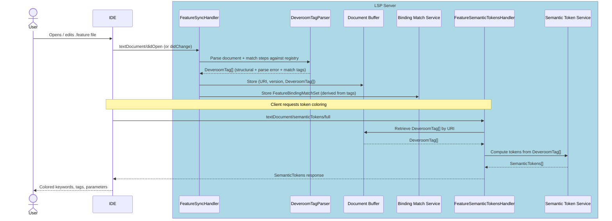

> **Note**: Although `textDocument/didChange` may carry only the incremental text delta, the Gherkin parser always re-parses the **entire file**. Gherkin AST nodes carry absolute line/column locations; inserting or deleting a line shifts the position of every subsequent node, making partial re-parse impractical.

> **As-built note**: the sync handler does not call a raw `GherkinParser` directly. Instead it invokes `DeveroomTagParser` (`GherkinDocumentTaggerService`), which wraps `DeveroomGherkinParser` (the Gherkin parse step) and in the **same AST walk** produces a `DeveroomTag[]` tree encoding all downstream-needed classification info: structural spans (keywords, tags, descriptions, comments, doc strings, data tables), parse error spans, and — when a binding registry is available — step match results (`DefinedStep`, `UndefinedStep`, `StepParameter`, `ScenarioOutlinePlaceholder`, hook references). The Document Buffer stores this tag tree rather than a raw AST; the `SemanticTokenService` reads the tag tree directly. A `FeatureBindingMatchSet` is derived from the tags and stored in the `BindingMatchService` for use by Go to Definition, diagnostics, and find-usages features.
>
> This combined-pass design avoids joining AST structural info with match results at render time, and mirrors the approach from the existing `Reqnroll.VisualStudio` extension.

---

### F2 · Binding Discovery

**Phase 2** — prerequisite for F3, F5, F6, F8, F14, F15, F16, F17, F18

#### End-user experience

This feature is infrastructure, not directly visible. The outcome is that the LSP server maintains an up-to-date registry of step binding patterns, their locations in C# files, and their parameter types. This registry drives all step-related features.

Discovery starts automatically when a workspace folder is opened. The registry is updated when a `.cs` step file is saved (via Roslyn, immediately) or when the project is built (via the Connector, after compilation).

#### IDE support matrix

| VS Code | Visual Studio | Rider |
|---------|---------------|-------|
| ✅ Generic | ✅ Generic | ✅ Generic |

Both discovery paths are managed by the LSP server, so no IDE-specific code is required.

#### LSP messages

| Direction | Method | Purpose |
|-----------|--------|---------|
| Client → Server | `textDocument/didOpen` / `didChange` (`.cs` files) | Trigger Roslyn re-discovery for changed file |
| Client → Server | `workspace/didChangeWatchedFiles` | Detect assembly changes (build complete) |
| Server (internal) | IPC to Connector | Launch reflection discovery, receive `BindingDiscoveryResult` |
| Server → Client | `textDocument/publishDiagnostics` | Push updated diagnostics after registry change |

> **Open question (Q9)**: How does the LSP server reliably detect that the solution has been rebuilt? Watching the output assembly path via `workspace/didChangeWatchedFiles` is the current assumption, but this needs verification per-IDE. See [Open Questions & Risk Register](LSP-IDE-Support-Open-Questions.md).

#### Sequence diagram

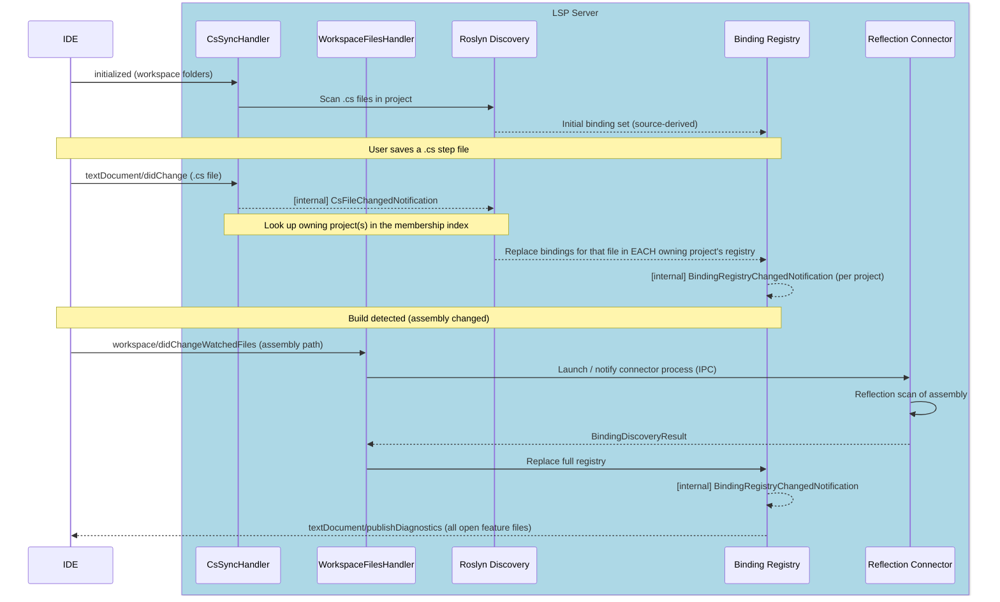

#### Implementation status

The Roslyn (source-level) path is **implemented**. The diagram above uses idealized component names; the as-built mapping is:

| Design element | As-built |
|---|---|
| `CsSyncHandler` receives `.cs` `didOpen`/`didChange` | `TextDocumentSyncHandler` (one sync handler for `.feature` + `.cs`, routed by extension) |
| Roslyn Discovery — scan / parse a `.cs` file | `StepDefinitionFileParser` (syntactic; discovers step definitions **and** hooks, with scopes) invoked via `ProjectBindingRegistry.ReplaceBindings(file)` |
| "Replace bindings for that file" | `ICSharpBindingDiscoveryService` → `ConnectorBindingRegistryProvider.ApplyRoslynFileUpdateAsync` (per-file replace layered on the current registry) |
| `BindingRegistryChangedNotification` | raised by the provider's `BindingRegistryChanged` event via `BindingRegistryProviderRouter`; consumed by `BindingRegistryChangedHandler`, which re-parses open feature files and refreshes semantic tokens |

**Merge / precedence**: the Roslyn patch is layered on top of the connector's current registry and intentionally does **not** advance the connector's last-good assembly hash. A real build (different assembly hash) therefore fully replaces the registry with the authoritative reflection result; with no rebuild, the connector run is a hash-match no-op and the source-level patch persists. This realizes the merge strategy described in [Architecture §7](LSP-IDE-Support-Architecture.md#7-binding-connector).

**Behavioural nuance**: a step renders as *unbound* (a `reqnroll.undefined_step` token / "step definition not found" diagnostic) only once the owning project has a **valid** (non-`Invalid`) registry — i.e. after any discovery has completed, whether the startup reflection run **or** the first Roslyn `.cs` open. Against an `Invalid` registry (no discovery yet) the tag parser skips step matching, leaving steps unclassified rather than unbound.

The reflection (post-build) trigger shown in the lower half of the diagram is also implemented: `WatchedFilesHandler` registers `workspace/didChangeWatchedFiles` watchers for `**/bin/**/*.dll` (and `**/reqnroll.json`) and calls `ConnectorBindingRegistryProvider.TriggerRefresh()` for the project whose output path matches. An initial run is likewise triggered on `reqnroll/projectLoaded`. Whether each IDE reliably *delivers* those watched-file events on build remains [Q9](LSP-IDE-Support-Open-Questions.md).

> **Planned change — index-driven, multi-project routing.** As built, `CSharpBindingDiscoveryService` routes a `.cs` edit to a **single** owning project via `ILspWorkspaceScopeManager.GetProjectForUri` (longest folder-prefix match). Under the [membership-index design](LSP-IDE-Support-Architecture.md#project-membership-the-path--projects-index) this becomes a lookup returning the **set** of owning projects, and the per-file Roslyn patch fans out to *each* of their registries (a linked `.cs` legitimately belongs to several projects, so one edit invalidates several registries). The same lookup **gates** the patch: a `.cs` that no project's index claims — e.g. one excluded from its `.csproj` but opened in the editor — contributes bindings to **no** registry, preventing phantom bindings that would otherwise be wiped on the next build. The folder-prefix match is retained only as the fallback for projects that have not (yet) sent a `reqnroll/projectFiles` baseline.

#### Known limitations

**Custom-derived binding attributes are not discovered by Roslyn (source-level) discovery.** The in-process Roslyn parser (`StepDefinitionFileParser`) is intentionally *syntactic only* — it parses a single `.cs` file into a syntax tree with no `Compilation` or semantic model — and recognizes bindings by matching the attribute's simple name against the known Reqnroll attribute names (`Given`/`When`/`Then`/`StepDefinition` and the hook attributes, allowing for namespace qualification and the `Attribute` suffix). A user-defined attribute that *derives* from a Reqnroll binding attribute (e.g. `class GivenWebAttribute : GivenAttribute`) is therefore **not** detected by the immediate-on-save Roslyn path, because resolving the inheritance chain would require a semantic model with the project's references.

Such bindings are still discovered by the out-of-process reflection **Connector** after a build, since reflection inspects the actual attribute type hierarchy. The practical effect is that a step bound via a custom-derived attribute will appear unmatched (warning squiggle) until the next build, after which it resolves normally.

We are **not** addressing this at this time. Closing the gap would mean feeding the Roslyn parser a project `Compilation` (Reqnroll + project references) and walking `INamedTypeSymbol.BaseType`, which is a larger change to how `CSharpBindingDiscoveryService` obtains source — it currently parses each `.cs` file in isolation. The limitation is captured by a skipped test in `StepDefinitionFileParserTests`.

---

### F3 · Gherkin File Diagnostics

**Phase 2** — covers both missing step warnings and parse errors

> **Open question (Q19)**: Should the server also support diagnostic pull (`textDocument/diagnostic` request, LSP 3.17+) in addition to the push model described here? See [Open Questions & Risk Register](LSP-IDE-Support-Open-Questions.md).

#### End-user experience

Two categories of diagnostic are displayed for `.feature` files:

- **Binding mismatches** (`DiagnosticSeverity.Warning`, yellow squiggle, `source: "reqnroll.binding"`): steps that have no matching binding are underlined. Hovering shows "Step definition not found."
- **Parse errors** (`DiagnosticSeverity.Error`, red squiggle, `source: "reqnroll.parser"`): structurally invalid Gherkin (e.g., missing `Feature:` header, invalid tag syntax) is underlined with a description.

Both categories are computed after every edit and pushed as a **single** `textDocument/publishDiagnostics` message. The LSP specification requires that one message delivers the complete diagnostic set for a URI; separate messages would clear previously delivered diagnostics of the other category. A `DiagnosticsAggregator` combines both sources before sending.

Diagnostics refresh after every `textDocument/didChange` and also whenever the Binding Registry changes (C# file save or build). On `textDocument/didClose`, an **empty** `textDocument/publishDiagnostics` is pushed for the closed URI to clear any squiggles the IDE retained.

> **Design rationale — color and squiggles are complementary, not redundant**: F1/F2 already color unbound steps (purple in Visual Studio). F3 diagnostics are still required because: (a) squiggles appear in the IDE Problems panel / Error List, enabling cross-file triage and keyboard navigation ("Next Warning") that color cannot provide; (b) color-only feedback is inaccessible to colorblind users. Using `Warning` rather than `Error` for binding mismatches distinguishes them visually from parse errors and accommodates step-first development workflows where a binding may not yet exist.

#### IDE support matrix

| VS Code | Visual Studio | Rider |
|---------|---------------|-------|
| ✅ Generic | ✅ Generic | ✅ Generic |

#### LSP messages

| Direction | Method | Purpose |
|-----------|--------|---------|
| Client → Server | `textDocument/didOpen` / `didChange` / `didSave` | Trigger diagnostic pipeline for this file |
| Server → Client | `textDocument/publishDiagnostics` | Push combined diagnostic set (one message per URI) |

#### Sequence diagram — feature file change

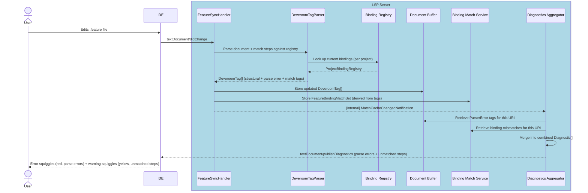

> **As-built note**: parsing and binding matching are **not separate pipeline stages**. `DeveroomTagParser` performs both in a single AST walk (see [F1 · as-built note](#f1--gherkin-syntax-highlighting)). Parse errors emerge as `DeveroomTag` items of type `ParserError` — not a separate `ParseErrors[]` — so the `DiagnosticsAggregator` retrieves them from the tag tree alongside `UndefinedStep` and `BindingError` tags. `MatchCacheChangedNotification` is published directly by the sync handler after storing the new tags and match set, skipping the intermediate `ASTChangedNotification` / `BindingMatchInternalHandler` stages.

#### Sequence diagram — binding registry change (C# file saved or build completed)

> **Diagnostic ownership note**: When the Binding Registry changes due to a `.cs` file edit or a build, the Reqnroll LSP server pushes updated `textDocument/publishDiagnostics` messages **only for `.feature` file URIs**. Diagnostics for `.cs` files (C# parse errors, type errors, etc.) are the exclusive domain of the native C# language server in each IDE; the Reqnroll LSP must not publish competing diagnostics for `.cs` URIs. Binding-level annotations on `.cs` files (e.g., unused step warnings) are delivered separately via Code Lens (F18) rather than diagnostics.

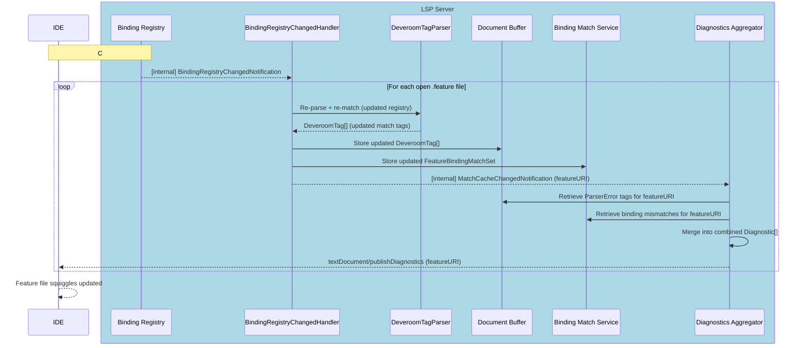

> **As-built note**: when the registry changes, `BindingRegistryChangedHandler` re-invokes `DeveroomTagParser` for each open feature file. Because `DeveroomTagParser` takes the snapshot text (not a cached AST) as input, the Gherkin text is re-parsed on every registry-change re-tag — a minor inefficiency versus a pure re-match on a cached AST. This is accepted because Gherkin parsing is fast and caching the intermediate `DeveroomGherkinDocument` separately from the tag tree would add complexity without a compelling user-visible benefit.

> **As-built note — implementation classes**: the "DA" participant in the sequence diagrams above covers two cooperating classes. `DiagnosticsAggregator` (`LSP.Core/Diagnostics/`) is a protocol-agnostic service that converts `ParserError` tags and `FeatureBindingMatchSet.Undefined` steps into `GherkinDiagnostic` records (no OmniSharp dependency). `DiagnosticsPublishHandler` (`LSP.Server/Handlers/InternalHandlers/`) is the `INotificationHandler<MatchCacheChangedNotification>` that retrieves tags and the match set, calls the aggregator, converts `GherkinDiagnostic.Range` to LSP `Position` values (same `ResolvePosition` algorithm as `SemanticTokenService`), and pushes via `ILanguageServerFacade.SendNotification("textDocument/publishDiagnostics", PublishDiagnosticsParams)` — the same pattern used by `SemanticTokensPushHandler`. `DiagnosticsPublishHandler` is auto-discovered by the `AddMediatR(typeof(Program))` scan; no explicit DI registration is needed. The `textDocument/didClose` empty-diagnostics push is handled inline in `TextDocumentSyncHandler.Handle(DidCloseTextDocumentParams)` rather than via a separate notification, since no fan-out is required.

---

### F4 · Gherkin Parse Error Display

**Phase 2** — implemented as part of the F3 diagnostics pipeline

#### End-user experience

Structural errors in `.feature` files (e.g., missing `Feature:` header, invalid tag syntax) are shown as red error squiggles with a description, distinct from the yellow warning squiggles of missing step bindings.

#### IDE support matrix

| VS Code | Visual Studio | Rider |
|---------|---------------|-------|
| ✅ Generic | ✅ Generic | ✅ Generic |

#### Implementation note

Parse errors are produced by `DeveroomTagParser` whenever a `.feature` file is parsed (`textDocument/didOpen` or `didChange`). Rather than a separate `ParseErrors[]` array, each parse error is stored as a `DeveroomTag` of type `ParserError` in the tag tree alongside structural and match tags. The `DiagnosticsAggregator` reads these `ParserError` tags from the Document Buffer and emits them as `DiagnosticSeverity.Error` items with `source: "reqnroll.parser"` to distinguish them from binding mismatch warnings. The complete combined `textDocument/publishDiagnostics` flow is described in [F3](#f3--gherkin-file-diagnostics).

---

### F5 · Go to Step Definition

**Phase 2**

#### End-user experience

Pressing **Go to Definition** (F12 / Ctrl+Click) on a step in a `.feature` file navigates to the matching `[Given]` / `[When]` / `[Then]` method in the C# binding class. If multiple bindings match (ambiguous), a picker is shown.

> **Open question (Q20)**: Should this feature use `textDocument/definition` or `textDocument/implementation`? In LSP semantics, a step text is closer to a specification (definition) while the binding method is its implementation. The correct choice affects how IDEs route the navigation gesture. See [Open Questions & Risk Register](LSP-IDE-Support-Open-Questions.md).

> **Open question (Q21)**: Should the server also support `textDocument/documentLink`? This would annotate step lines as Ctrl+hover hyperlinks — a complementary navigation path that requires no keystroke. See [Open Questions & Risk Register](LSP-IDE-Support-Open-Questions.md).

#### IDE support matrix

| VS Code | Visual Studio | Rider |
|---------|---------------|-------|
| ✅ Generic | ✅ Generic | 🔧 Plugin |

**Rider note**: Cross-language navigation from a `.feature` step into a `.cs` file requires the `ReqnrollFeatureDefinitionReferenceProvider` PSI bridge — Rider's native LSP client cannot perform this navigation without it. This was confirmed by the Thomas Heijtink PoC. See [Architecture §6.3](LSP-IDE-Support-Architecture.md#63-rider) for implementation details.

#### LSP messages

| Direction | Method | Purpose |
|-----------|--------|---------|
| Client → Server | `textDocument/definition` | Request location of step definition |
| Server → Client | `Location` / `Location[]` response | C# file URI + range |

#### Sequence diagram

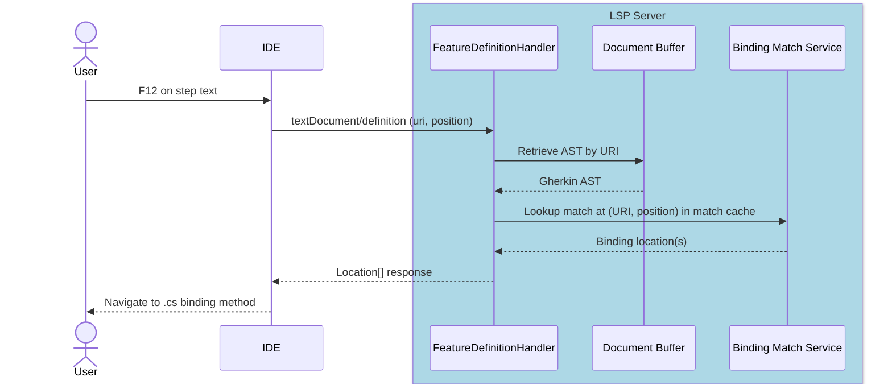

---

### F6 · Define Steps (Scaffolding)

**Phase 2**

#### End-user experience

When one or more steps have no matching binding, a code action "Define missing steps" appears (lightbulb / quick-fix). Activating it generates stub binding methods in a new or existing step definition file, with method signatures and parameter types inferred from the step text.

#### IDE support matrix

| VS Code | Visual Studio | Rider |
|---------|---------------|-------|
| ✅ Generic | ✅ Generic | ✅ Generic |

#### LSP messages

| Direction | Method | Purpose |
|-----------|--------|---------|
| Client → Server | `textDocument/codeAction` | Request available actions at cursor/selection |
| Server → Client | `CodeAction[]` response | List including "Define missing steps" |
| Client → Server | `codeAction/resolve` (optional) | Resolve edit lazily |
| Server → Client | `workspace/applyEdit` | Apply generated step file content |

> **Note**: When the client applies a `WorkspaceEdit` that creates or modifies a `.cs` file, the resulting `textDocument/didChange` triggers `CsSyncHandler`, which initiates Roslyn re-discovery and keeps the Binding Registry current.

#### Sequence diagram

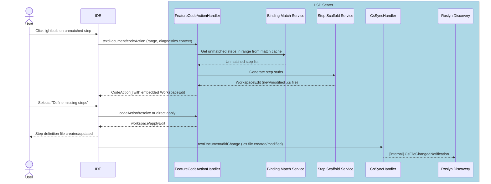

---

### F7 · Keyword Completion

**Phase 3** — **Implemented** (branch `f7_and_f8_completions`)

#### As-built notes

- **Handler**: `GherkinCompletionHandler` (`LSP.Server/Handlers/ProtocolHandlers/`) implements `ICompletionHandler` and is registered via OmniSharp dynamic registration (`AddHandler<GherkinCompletionHandler>()`, document selector `**/*.feature`).
- **Core logic**: `CompletionService.GetKeywordCompletions(TokenType[], GherkinDialect)` and `GetDefaultKeywordCompletions(GherkinDialect)` in `LSP.Core/Editor/Completions/`.
- **Token dispatch**: `DeveroomGherkinDocument.GetExpectedTokens(line, monitoringService)` → switch on `TokenType`; fallback is the default keyword set (Feature, Scenario, steps).
- **Keyword format**: Block keywords (FeatureLine, ScenarioLine, etc.) get `": "` appended because Gherkin dialect keywords have no trailing colon. Step keywords from the dialect already include a trailing space.
- **Dialect fallback**: `new GherkinDialectProvider(lang).DefaultDialect` (public API) rather than the `internal` `ReqnrollGherkinDialectProvider`.
- **Insert text**: `TextEditOrInsertReplaceEdit` wrapping a `TextEdit` spanning the keyword range on the current line.
- **Tests**: `CompletionServiceKeywordTests` (19 unit tests) + `KeywordCompletion.feature` spec (5 scenarios).

#### End-user experience

Typing at the start of a line in a Gherkin scenario offers completions for keywords valid in the current context (`Given`, `When`, `Then`, `And`, `But`, `Scenario:`, `Feature:`, etc.). Completions are context-sensitive: `Examples:` only appears inside a Scenario Outline; `Background:` only at feature level.

> **Gherkin dialect note**: Completion items are sourced from the active Gherkin dialect configured in the project's `reqnroll.json`. If the project specifies `"language": "de"`, completions offer `Gegeben`, `Wenn`, `Dann` rather than `Given`, `When`, `Then`.

#### IDE support matrix

| VS Code | Visual Studio | Rider |
|---------|---------------|-------|
| ✅ Generic | ✅ Generic | ✅ Generic |

#### LSP messages

| Direction | Method | Purpose |
|-----------|--------|---------|
| Client → Server | `textDocument/completion` | Request completions at position |
| Server → Client | `CompletionList` response | Keyword completion items |
| Client → Server | `completionItem/resolve` | Resolve detail/documentation lazily |

#### Sequence diagram

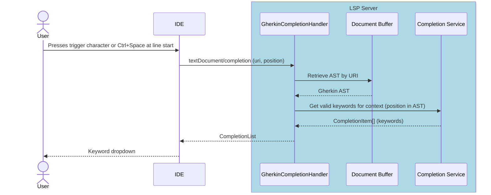

---

### F8 · Step Completion

**Phase 4** — **Implemented** (branch `f7_and_f8_completions`)

#### As-built notes

- **Handler**: same `GherkinCompletionHandler` as F7. Step completion is dispatched when the cursor is on a step line (`DeveroomTagTypes.StepBlock` tag) and `cursorOffset >= stepTextStart` (past the keyword).
- **Step text start**: `snapshotLine.Start + (step.Location.Column - 1) + step.Keyword.Length` (1-based Gherkin location, keyword includes trailing space).
- **Core logic**: `CompletionService.GetStepCompletions(step, typedAfterKeyword, registry, usageCounter, matcher)` in `LSP.Core/Editor/Completions/`.
  - Filters `ProjectStepDefinitionBinding` by `ScenarioBlock` matching the step keyword.
  - Samples each binding via `StepDefinitionSampler.GetStepDefinitionSample()` (ported from Reqnroll.VisualStudio).
  - Deduplicates identical samples.
  - Ranks via `ICompletionMatcher.Rank()` → default implementation is `ReturnAllCompletionMatcher` (pass-through, `IsIncomplete=false`).
  - `SortText` = zero-padded rank index (6 digits).
- **Insert format**: literal sample text, e.g. `"I have entered [int] into the calculator"` — no snippet placeholders. The `TextEdit` replaces from the step text start to end of the step line.
- **Sampler**: `StepDefinitionSampler` uses `RegexStepDefinitionExpressionAnalyzer` to walk regex parts, substituting type placeholders for capture groups. Choice groups like `(option1|option2)` are kept verbatim. netstandard2.0-compatible (no `[^1]` index syntax).
- **Usage count**: `IBindingMatchService.FindUsages(sourceLocation, projectFilter).Count` passed as `usageCounter` → forwarded to `ICompletionMatcher` for future ranking algorithms.
- **Q14 resolution**: `ReturnAllCompletionMatcher` passes all candidates to the client; the LSP client does the filtering. `ICompletionMatcher` is the extension point for FuzzySharp if needed.
- **Tests**: `CompletionServiceStepTests` (9 unit tests) + `StepDefinitionSamplerTests` (8 unit tests) + `ReturnAllCompletionMatcherTests` (5 unit tests) + `StepCompletion.feature` spec (4 scenarios).

#### End-user experience

When typing a step line after a keyword (`Given`, `When`, `Then`, etc.), the IDE offers completions matching existing step binding patterns. Completions include parameter placeholders styled appropriately and insert the full step text on selection.

> **Q14 resolved**: Client-side matching used (see [Open Questions](LSP-IDE-Support-Open-Questions.md#q14)).

#### IDE support matrix

| VS Code | Visual Studio | Rider |
|---------|---------------|-------|
| ✅ Generic | ✅ Generic | ✅ Generic |

#### LSP messages

Same as F7 (`textDocument/completion`) but triggered after a step keyword; completion items are derived from the Binding Registry rather than the keyword list.

#### Sequence diagram

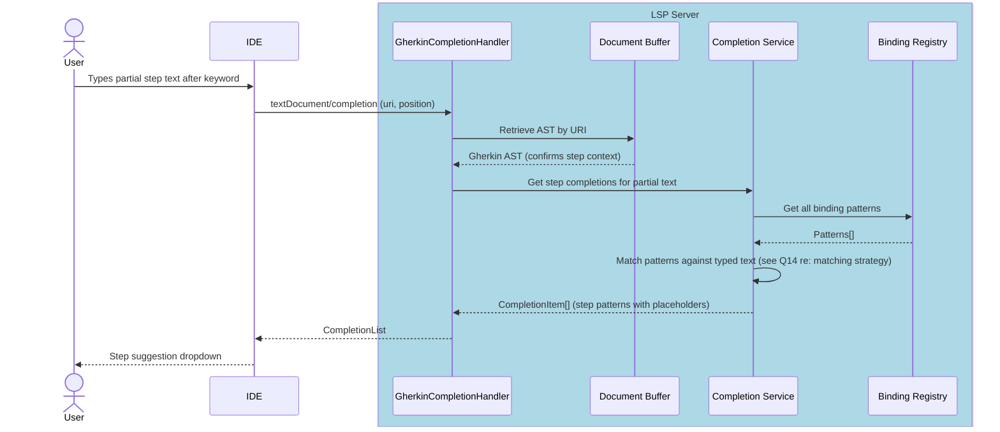

---

### F9 · Document Outline

**Phase 3**

#### End-user experience

The IDE's "Outline" or "Structure" panel shows the hierarchy of the feature file: Feature → Background / Rule → Scenario / Scenario Outline → Step. Clicking a node navigates to that location. Used for quick navigation in large feature files.

#### IDE support matrix

| VS Code | Visual Studio | Rider |
|---------|---------------|-------|
| ✅ Generic | ⚠️ VS-specific work required | ✅ Generic |

**Visual Studio caveat:** The standard LSP `textDocument/documentSymbol` handler is implemented and functional. However, VS does not route `documentSymbol` responses to its Document Outline window (View → Other Windows → Document Outline). That window uses legacy COM/`IVsHierarchy` APIs from the old language service model, not LSP. Confirmed by log analysis: VS registered the `documentSymbol` capability but never issued a `textDocument/documentSymbol` request during an active editing session with feature files open.

VS _does_ consume `textDocument/documentSymbol` for other surfaces (Navigation Bar dropdowns, Go to Member), but these require VS content-type plumbing to hook up for `.feature` files.

See [Q22](LSP-IDE-Support-Open-Questions.md#open-questions) for the options and decision.

#### LSP messages

| Direction | Method | Purpose |
|-----------|--------|---------|
| Client → Server | `textDocument/documentSymbol` | Request symbol hierarchy |
| Server → Client | `DocumentSymbol[]` response | Nested symbol tree |

#### Sequence diagram

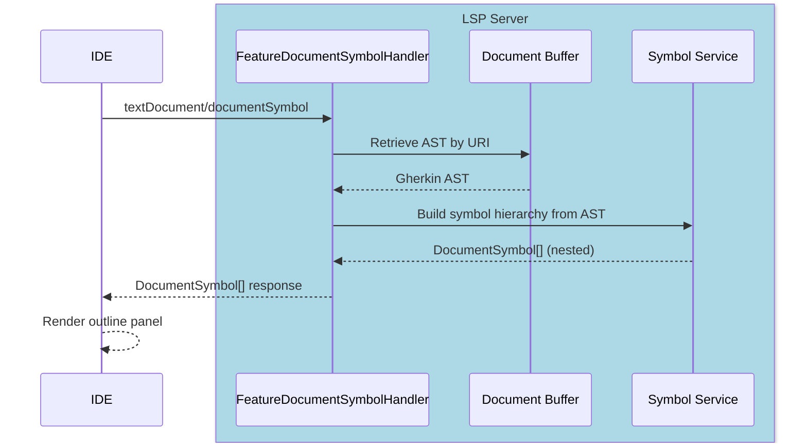

#### As-built notes

- `GherkinDocumentSymbolService` (LSP.Core) walks the `DeveroomTag` tree and returns a `GherkinDocumentSymbol` hierarchy (protocol-agnostic model).
- `FeatureDocumentSymbolHandler` (LSP.Server) converts to OmniSharp `DocumentSymbol[]` and registers via `AddHandler<>`.
- Symbol kind mapping: Feature→Module, Background→Constructor, Rule→Namespace, Scenario/ScenarioOutline→Method, Step→Field, Examples→Array.
- `DocumentSymbol.Children` is `init`-only; children must be wrapped in `Container<DocumentSymbol>` and set in the object initializer.
- VS integration gap documented above; all other LSP-native clients (VS Code, Rider) receive the outline via the generic handler.

---

### F10 · Code Folding

**Phase 3**

#### End-user experience

Scenarios, Backgrounds, Rules, doc strings, and data tables can be collapsed in the editor gutter. Folding regions update as the document is edited.

#### IDE support matrix

| VS Code | Visual Studio | Rider |
|---------|---------------|-------|
| ✅ Generic | ✅ Generic | ✅ Generic |

#### LSP messages

| Direction | Method | Purpose |
|-----------|--------|---------|
| Client → Server | `textDocument/foldingRange` | Request foldable regions |
| Server → Client | `FoldingRange[]` response | Start/end line pairs |

#### Sequence diagram

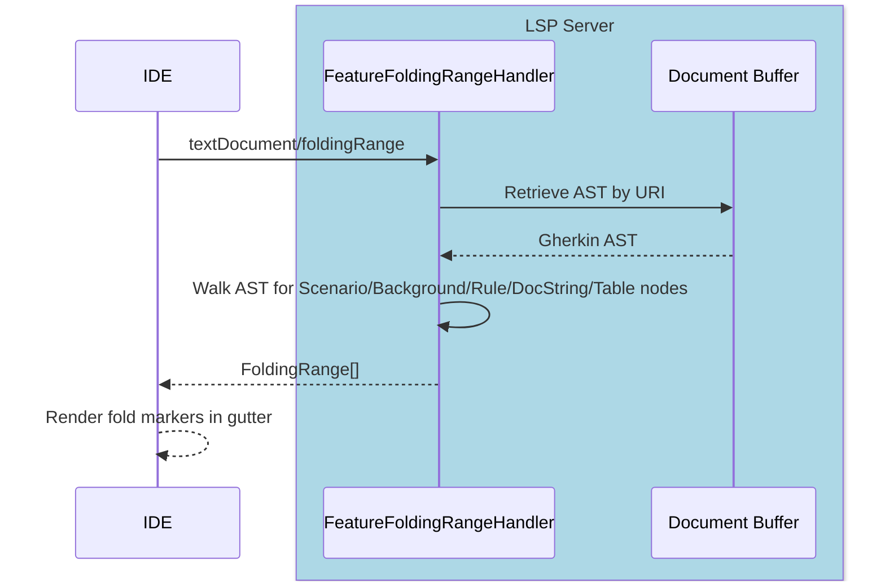

---

### F11 · Document Auto-formatting

**Phase 3**

#### End-user experience

**Format Document** (Shift+Alt+F or equivalent) re-indents the entire feature file: consistent indentation per nesting level, normalized spacing around keywords, blank lines between scenarios. Formatting rules are read from `.editorconfig` (indent size, line endings).

#### IDE support matrix

| VS Code | Visual Studio | Rider |
|---------|---------------|-------|
| ✅ Generic | ✅ Generic | ⚠️ Config |

**Rider note**: Rider has its own formatter framework and may partially handle formatting independently. Behavior should be tested to confirm `textDocument/formatting` takes priority.

#### LSP messages

| Direction | Method | Purpose |
|-----------|--------|---------|
| Client → Server | `textDocument/formatting` | Format whole document |
| Client → Server | `textDocument/rangeFormatting` | Format selection |
| Client → Server | `textDocument/onTypeFormatting` | Format as user types (e.g., on `\n`) |
| Server → Client | `TextEdit[]` response | Set of text edits |

#### Sequence diagram

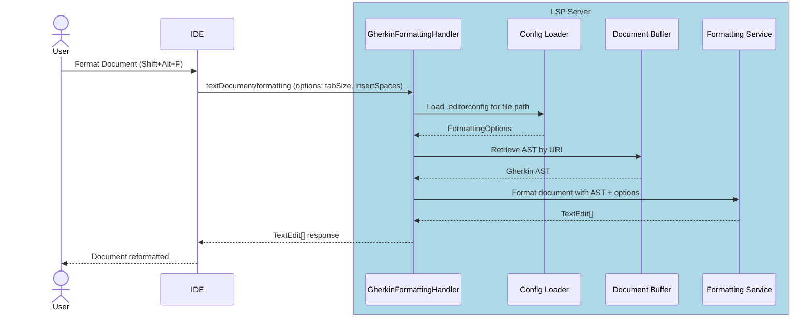

#### As-built (branch `f11_documentformatting`)

| Component | Location |
|-----------|----------|
| `GherkinDocumentFormatter` | `LSP.Core/Editor/Services/Formatting/GherkinDocumentFormatter.cs` |
| `GherkinFormatSettings` | `LSP.Core/Editor/Services/Formatting/GherkinFormatSettings.cs` |
| `DocumentLinesEditBuffer` | `LSP.Core/Editor/Services/Formatting/DocumentLinesEditBuffer.cs` |
| `GherkinFormattingHandler` | `LSP.Server/Handlers/ProtocolHandlers/GherkinFormattingHandler.cs` |
| Unit tests | `LSP.Core.Tests/Editor/Services/Formatting/GherkinDocumentFormatterTests.cs` |
| Spec tests | `LSP.Server.Specs/Features/Editor/DocumentFormatting.feature` |

**Implementation notes:**

- A single `TextEdit` replacing the entire document is returned for `textDocument/formatting` and `textDocument/rangeFormatting`. For range formatting, extra blank lines at the start/end of the range are trimmed.
- `GherkinDocumentFormatter` re-indents keywords by nesting level (Feature → Scenario → Step) using `\t` characters by default; `GherkinFormatSettings` controls indent char, line endings, and numeric right-alignment in tables.
- `DocumentLinesEditBuffer` holds the raw line array and is mutated in-place by both document and table formatters; the final joined text is returned as the `newText` of the single edit.
- The cursor-position `TextEdit` range is captured *before* calling the formatter (which mutates the line array), using `originalEditEndLineLength` to reconstruct valid end-column offsets.

---

### F12 · Table Auto-formatting

**Phase 3**

#### End-user experience

When the user types `|` or presses Enter inside a Gherkin data table (or Examples table), the columns are padded so pipes align. The table can also be aligned via Format Document (F11). If the table row is missing a final trailing pipe character `|`, one is appended.

#### IDE support matrix

| VS Code | Visual Studio | Rider |
|---------|---------------|-------|
| ✅ Generic | ✅ Generic | ⚠️ Config |

**Rider note**: Same caveat as F11.

#### LSP messages

| Direction | Method | Purpose |
|-----------|--------|---------|
| Client → Server | `textDocument/onTypeFormatting` | Align table on `\|` or `\n` |
| Server → Client | `TextEdit[]` response | Column-padding adjustments |

On-type trigger characters: `|` (first), `\n` (more).

#### Sequence diagram

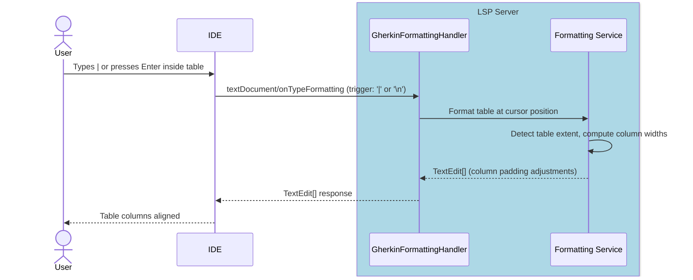

#### As-built (branch `f11_documentformatting`)

Implemented in the same `GherkinFormattingHandler` as F11. Key details:

- **Trigger characters**: `|` (first), `\n` (more). `\t` was evaluated but VS 2022 routes Tab to the completion handler rather than `onTypeFormatting`, so it is omitted.
- **Table detection**: `FindTableLineRange` scans up/down from cursor for lines whose `TrimStart()` begins with `|`. `FindTableAtLine` locates the Gherkin AST node (DataTable or Examples table) at that position for the formatter.
- **`\n` trigger cursor handling**: When Enter is pressed, the cursor is on the new empty line below the last table row. `editEnd` is extended to `cursorLine` and the `newText` includes a trailing line-ending; the edit range end is `(cursorLine, 0)`. This is the `cursorBelowTable` pattern.
- **Range end column**: `originalEditEndLineLength` is captured *before* calling `FormatTable` (which mutates the line array) so the range end column references the original document position.
- **VS 2022 interaction**: VS has a built-in Gherkin language service that auto-inserts ` ` after `|` in table rows and routes `|`, ` `, `\r`, `\t` to its completion handler. When `textDocument/completion` for these triggers returns `[]`, VS reverts the typed character from the document. To prevent this, `GherkinCompletionHandler.HandleKeyword` checks `_clientIde.IsVisualStudio` (via the injected `ClientIdeContext`) and returns a single `| ` (cell separator) completion item with a zero-length insert range when the line starts with `|`. For VSCode/Rider (non-VS clients), an empty `CompletionList` is returned — the correct LSP response. VS-specific behaviour is covered by `KeywordCompletionVisualStudio.feature`; general behaviour by `KeywordCompletion.feature`. The on-type formatting edits are sent correctly by the server; VS's internal document-change pipeline may apply them with a delay or override them via its auto-insert mechanism.

---

### F13 · Comment / Uncomment

**Phase 3**

#### End-user experience

A keyboard shortcut (Ctrl+/) toggles `#` comments on the selected line(s) in a `.feature` file.

LSP has no native comment/uncomment capability. This requires a custom command round-trip: the IDE client captures the keybinding and delegates to the server via `workspace/executeCommand`, which returns a `WorkspaceEdit`.

#### IDE support matrix

| VS Code | Visual Studio | Rider |
|---------|---------------|-------|
| 🔧 Plugin | 🔧 Plugin | 🔧 Plugin |

All three IDEs require a small amount of custom code to:
1. Intercept the comment keybinding and redirect it (preventing the IDE's default comment handler from firing for `.feature` files)
2. Send `workspace/executeCommand` with the current selection
3. Apply the returned `WorkspaceEdit`

#### LSP messages

| Direction | Method | Purpose |
|-----------|--------|---------|
| Client → Server | `workspace/executeCommand` (`reqnroll.toggleComment`) | Toggle comment on lines in range |
| Server → Client | `workspace/applyEdit` | Text insertions/deletions for `#` |

#### Sequence diagram

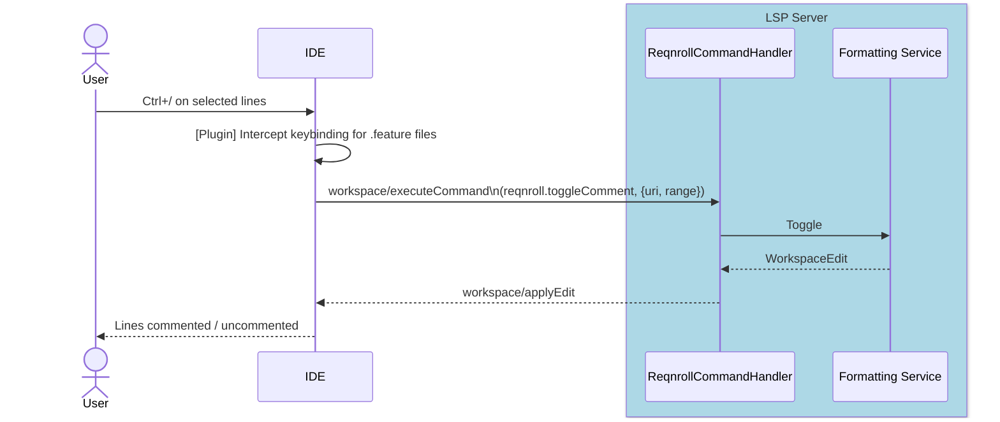

#### VS Code — as-built

F13 is **implemented** on `feat/vscode-extension-initial`, matching the design above with no deviation:

| Design element | As-built |
|---|---|
| Keybinding interception | `package.json` `contributes.keybindings` binds `ctrl+/` (`cmd+/` on macOS) to `reqnroll.toggleComment`, scoped by `"when": "editorTextFocus && editorLangId == gherkin"` — VS Code's own comment-toggle keybinding does not fire for `gherkin`-language documents. |
| Command handler | `reqnroll.toggleComment` (registered in [`extension.ts`](../src/VSCode/src/extension.ts)) delegates to `doToggleComment` in [`commentToggle.ts`](../src/VSCode/src/commentToggle.ts). |
| Selection normalization | `normalizeSelectionLines` ([`selectionUtils.ts`](../src/VSCode/src/selectionUtils.ts)) trims a trailing selected line when VS Code reports the selection ending at `(line, 0)` — i.e. the user dragged past the end of the previous line without selecting any character on the next one — so that line is not spuriously toggled. |
| Request | `doToggleComment` sends `workspace/executeCommand` (`reqnroll.toggleComment`, `[uri, startLine, endLine]`) via `client.sendRequest(ExecuteCommandRequest.type, ...)` and lets the returned `WorkspaceEdit` apply through the standard LSP client machinery; failures surface via `vscode.window.showErrorMessage`. |
| Menu presence | Also available via editor context menu (`editor/context`, group `1_modification`) and the command palette, both gated on `editorLangId == gherkin`. |

---

### F14 · Find Step Definition Usages

**Phase 4**

#### End-user experience

**Find All References** invoked on a C# step binding method (i.e., a method decorated with `[Given]`, `[When]`, or `[Then]`) finds all `.feature` file steps that match that binding and displays them in the IDE's references panel. This is the inverse of Go to Definition (F5).

#### IDE support matrix

| VS Code | Visual Studio | Rider |
|---------|---------------|-------|
| ⚠️ Config | ⚠️ Config | ⚠️ Config |

**Dispatch ambiguity note**: In a `.cs` file, both the native C# language server and the Reqnroll LSP server register for `textDocument/references`. The intent is that when the caret is positioned on a **binding attribute** (e.g., `[Given("step text")]`), the IDE dispatches the request to the Reqnroll server, returning matching `.feature` step locations. When the caret is on the **method signature or body**, the C# server handles it normally.

Whether IDEs reliably dispatch based on caret position within a file that has multiple registered servers is not guaranteed. If the dispatch is unreliable, the feature will be surfaced as a custom menu/context-menu command (requiring 🔧 Plugin work for each IDE) that explicitly invokes `workspace/executeCommand` rather than relying on `textDocument/references`.

#### LSP messages

| Direction | Method | Purpose |
|-----------|--------|---------|
| VS Extension → Server | `reqnroll/findStepUsages` (custom, owned pipe) | Three-state response: `{isBinding:false}` / `{isBinding:true,locations:[]}` / `{isBinding:true,locations:[...]}` |
| Client → Server | `textDocument/references` (at attribute position) | Two-state fallback (VS Code, Rider, spec tests): empty = no match or not a binding |
| Server → Client | `Location[]` / `FindStepUsagesResponse` | Step locations in `.feature` files |

#### Sequence diagram (Visual Studio — as-built)

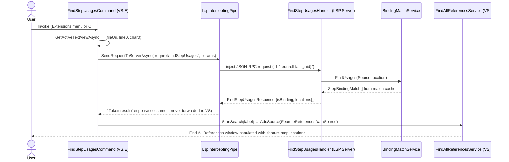

#### Implementation status

F14 is **implemented**. The as-built mapping is:

| Design element | As-built |
|---|---|
| `StepReferencesHandler` registered for `textDocument/references` | Registered via `options.OnRequest` (same static-registration pattern as semantic tokens) to avoid OmniSharp dynamic-registration ambiguity with the C# language server on `.cs` files (see Q13). Retained for VS Code / Rider / spec-test compatibility. |
| `FindStepUsagesHandler` registered for `reqnroll/findStepUsages` | Custom request handler ([FindStepUsagesHandler.cs](../src/LSP/Reqnroll.IdeSupport.LSP.Server/Handlers/ProtocolHandlers/FindStepUsagesHandler.cs)). Delivers the full three-state contract: `{isBinding:false}` = not a binding; `{isBinding:true, locations:[]}` = 0 usages; `{isBinding:true, locations:[...]}` = usages. Response type: `FindStepUsagesResponse` ([Protocol/FindStepUsagesResponse.cs](../src/LSP/Reqnroll.IdeSupport.LSP.Server/Protocol/FindStepUsagesResponse.cs)). Each location includes `stepText` (extracted from in-memory snapshot), `keyword`, `scenarioName`, `projectName`. **Protocol note:** returns `{isBinding:false}` rather than JSON null — OmniSharp's `OnRequest` framework sends an error response for null returns from custom-method handlers, so `IsBinding=false` is the "not a binding" sentinel. |
| Binding location lookup | `IBindingMatchService.FindUsages(SourceLocation)` — iterates all cached `FeatureBindingMatchSet` entries and returns every `StepBindingMatch` whose `BindingLocations` match the supplied file + line (column is ignored; line is 1-based) |
| Document ID on match results | `StepBindingMatch.FeatureDocumentId` (added for F14) carries the feature file's document URI, eliminating the need for a tuple return from `FindUsages` |
| LSP position → `SourceLocation` conversion | Handlers convert 0-based LSP line/character to 1-based `SourceLocation(file, line+1, char+1)` |
| `GherkinRange` → LSP `Range` | `GherkinRangeExtensions.ToLspRange()` (new `LSP.Server`-layer extension); pure offset-to-line geometry lives in `GherkinRange.ResolveOffset` (`LSP.Core`) |
| Workspace-wide scan on startup | `BindingRegistryChangedNotification.IsFullReplacement` flag (added for F14): `true` when fired by the Connector / reflection path, `false` for Roslyn incremental. A full replacement triggers `BindingRegistryChangedHandler.ScanAllFeatureFilesAsync`, which calls `IGherkinDocumentTaggerService.ScanClosedFileAsync` for every `.feature` file in the project folder not already held in the open-document buffer. **As-built limitation, with chosen resolution**: this folder glob *misses* linked feature files outside the project folder and *wrongly admits* feature files excluded from the `.csproj`. Per the [membership-index design](LSP-IDE-Support-Architecture.md#project-membership-the-path--projects-index), closed-file enumeration moves from the folder glob to the project's `reqnroll/projectFiles` baseline — scan exactly the feature files the project actually includes, links and all, and nothing it excludes. See [Q17](LSP-IDE-Support-Open-Questions.md). |
| Incremental update on Roslyn edit | `IsFullReplacement = false` → only currently open feature files are re-parsed; closed files retain their cached match sets |
| VS command — Surface 1 (Extensions menu) | `FindStepUsagesCommand` ([FindStepUsages/FindStepUsagesCommand.cs](../src/VisualStudio/Reqnroll.IdeSupport.VisualStudio.Extension/FindStepUsages/FindStepUsagesCommand.cs)) — `[VisualStudioContribution]` VS.Extensibility command; `GetActiveTextViewAsync` → `(fileUri, line0, char0)` → `FindStepUsagesService.FindUsagesAsync` → `FindStepUsagesRenderer.RenderAsync`. |
| VS command — Surface 2 (C# editor context menu) | Same command, second placement: `CommandPlacement.VsctParent(guidSHLMainMenu, IDG_VS_CODEWIN_NAVIGATETOLOCATION=0x02B1, priority=0x0100)`. Item appears next to "Find All References" in the code-window context menu. No `.vsct`, no VSSDK command table — targets the shell's built-in group directly. Requires experimental-instance reset after first deploy. |
| VS command — Surface 3 (Shift+F12 takeover) | **Deferred.** Would require an `IOleCommandTarget` editor command filter (MEF) intercepting GUID `{1496A755-94DE-11D0-8C3F-00C04FC2AAE2}` ID 97. Not implemented. |
| Owned-pipe RPC | `LspInterceptingPipe.SendRequestToServerAsync` injects a JSON-RPC request with id prefix `reqnroll-far-{guid}`. `TryCompleteCorrelatedResponse` consumes the matching response (never forwarded to VS) and completes the awaiting TCS. The response bypasses the LSP inspector log — the `FindStepUsagesService` file logger is the only diagnostic window. |
| Results rendering | `FindStepUsagesRenderer` switches to UI thread (`JoinableTaskFactory`), locates `IFindAllReferencesService` via `SVsFindAllReferences`, calls `StartSearch(label)` → `window.Manager.AddSource(FeatureReferencesDataSource)`. `FeatureReferencesDataSource` pushes all `FeatureReferenceTableEntry` items in `Subscribe`. |
| DI injection | `FindStepUsagesState` singleton registered in `ExtensionEntrypoint.InitializeServices`. `ReqnrollLanguageClient` populates it on server-init / clears on dispose. `FindStepUsagesCommand` injects `(FindStepUsagesState, TraceSource)` only — both guaranteed resolvable from the VS.Extensibility DI container. (Injecting `ReqnrollLanguageClient` directly caused silent construction failure because contribution classes are not resolvable as injection targets.) |

> **As-built note — VS "Find All References" does not integrate automatically.** VS does not dispatch `textDocument/references` to secondary LSP servers for `.cs` files; the C# language server intercepts unconditionally. Q13 is **resolved as "dispatch is unreliable"**. The custom VS.Extensibility command (`FindStepUsagesCommand`) instead injects `reqnroll/findStepUsages` directly over the owned `LspInterceptingPipe`. VS-validated end-to-end on the Experimental Instance (Surfaces 1 and 2, 2026-06-09).

#### VS Code — as-built

F14 is **implemented** on `feat/vscode-extension-initial` as a custom command rather than a `textDocument/references` binding — VS Code, like VS, has no reliable way to route `textDocument/references` on a `.cs` file to the Reqnroll server instead of the built-in C# extension, so the client sidesteps the dispatch-ambiguity question entirely (same conclusion as Q13, reached independently on the VS Code side):

| Design element | As-built |
|---|---|
| Invocation surfaces | Command palette / editor context menu (`reqnroll.findStepUsages`, `when: editorLangId == csharp`), and CodeLens click (see F18) — no reliance on `textDocument/references`. |
| Request | `doFindStepUsages` ([`stepUsages.ts`](../src/VSCode/src/stepUsages.ts)) sends the custom `reqnroll/findStepUsages` request directly (not `textDocument/references`), with `{textDocument, position, context: {includeDeclaration: false}}`. |
| Three-state response handling | Mirrors the server's `FindStepUsagesResponse` contract: `isBinding: false` shows an information message ("cursor is not on a step definition binding"); `isBinding: true` with zero locations shows "No usages found"; otherwise a `vscode.window.showQuickPick` lists each usage as `keyword stepText`, with scenario name as description and project name as detail. |
| Navigation | Selecting a QuickPick entry calls `openAndReveal` ([`navigationUtils.ts`](../src/VSCode/src/navigationUtils.ts)) to open the target `.feature` file and reveal the step location — no native "Find All References" panel integration (VS Code's references panel is not addressable from an extension for arbitrary custom data; the QuickPick is the VS Code-idiomatic substitute). |
| CodeLens integration | When invoked from a CodeLens item (F18), `extension.ts` receives `[uri, line, char]` as command arguments instead of reading the active editor's cursor position. A separate `reqnroll.noStepUsages` command (deliberately omitted from `package.json`'s `contributes.commands`, since it is never invoked from the palette) is the click target for CodeLens items reporting zero usages. |

---

### F15 · Find Unused Step Definitions

**Phase 4**

#### End-user experience

A command "Find Unused Step Definitions" scans the Binding Registry against the match cache and reports any binding methods in C# that have zero matched steps across all `.feature` files in the workspace. Results appear in the IDE's output or search panel.

This is a workspace-wide operation; it is implemented as a custom command handled server-side.

> **Cross-project semantics (membership index).** A binding `.cs` linked into several projects appears in *each* of their registries; a feature file may belong to several projects. "Unused" must therefore be evaluated against the [membership index](LSP-IDE-Support-Architecture.md#project-membership-the-path--projects-index), not folder layout: a binding is unused only if it has zero matched steps in **every** project that includes it (an *intersection* — symmetrically, F14 *unions* a binding's usages across all including projects). A folder-scoped analysis would falsely report a binding that is linked into project B and used by a feature in B as "unused" merely because project A — where the file physically lives — has no matching feature. Because false "unused" results invite deletion of live code, the analysis must only consider files the index actually attributes to a project, and must never let a binding contributed by the editor-open Roslyn path (in a project that does not own the file) suppress an "unused" result.

#### IDE support matrix

| VS Code | Visual Studio | Rider |
|---------|---------------|-------|
| 🔧 Plugin | 🔧 Plugin | 🔧 Plugin |

All IDEs require a small custom command handler to invoke `workspace/executeCommand` and display the results. The analysis itself is in the server.

#### LSP messages

| Direction | Method | Purpose |
|-----------|--------|---------|
| Client → Server | `workspace/executeCommand` (`reqnroll.findUnusedStepDefinitions`) | Trigger analysis |
| Server → Client | `window/showDocument` or custom notification | Surface results to user |

#### Sequence diagram

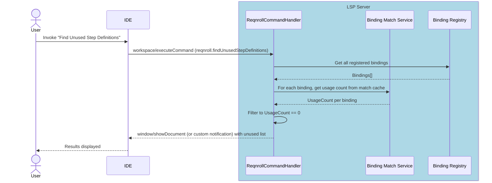

#### VS Code — as-built

F15 is **implemented** on `feat/vscode-extension-initial`:

| Design element | As-built |
|---|---|
| Command | `reqnroll.findUnusedStepDefinitions` (command palette only — no keybinding or context-menu placement) invokes `doFindUnusedStepDefinitions` ([`stepUsages.ts`](../src/VSCode/src/stepUsages.ts)), which sends `workspace/executeCommand` (`reqnroll.findUnusedStepDefinitions`) wrapped in `vscode.window.withProgress` so a "Scanning for unused step definitions…" notification is shown while the workspace-wide analysis runs. |
| Results display | Zero unused bindings shows an information message. Otherwise a `vscode.window.showQuickPick` lists each unused binding as `$(warning) ClassName.MethodName`, with the binding expression as description and project name as detail; selecting one opens the `.cs` source file and reveals the method via `openAndReveal`. |
| Deleted-`.cs`-file bug fix | The server-side bug documented in [VSCode-Extension-Implementation-Plan.md](VSCode-Extension-Implementation-Plan.md) — a deleted `.cs` file's step definitions lingering in the registry and causing the QuickPick's navigation to throw — was fixed by adding `ICSharpBindingDiscoveryService.RemoveFileAsync`, invoked from `WatchedFilesHandler` on `.cs` `FileChangeType.Deleted` events. VS Code's `synchronize.fileEvents: '**/*.{feature,cs}'` watcher (configured in `extension.ts`) already emits these delete events, so no VS Code-side change was needed once the server handled them. |
| Cross-project semantics | No VS Code-specific handling — the client is a thin pass-through to `workspace/executeCommand`; the membership-index intersection semantics described above are entirely server-side and apply identically regardless of client. |

---

### F16 · Step Rename Refactoring

**Phase 4** — prerequisite: F2 (binding registry), F3 (match sets), F14 membership index (Q17)

#### End-user experience

Renaming a step text (from either the `.feature` file step line or the C# `[Given("...")]` attribute string) updates all occurrences across the workspace: the attribute string in the binding class and every matching step in every `.feature` file.

Key behavioural properties:

- **Parameter preservation.** The expression's parameter slots (`(.*)`, `(\d+)`, Cucumber expression parameters) are preserved — the user renames the non-parameter text only. The parameter count and expression types must be identical before and after rename.
- **Scenario Outline blocking.** Steps in Scenario Outlines that contain `<placeholder>` tokens in the feature file step text are NOT renamed. Renaming would corrupt the data-binding relationship between the outline and its example set.
- **Derived-attribute support.** Custom attributes deriving from `[Given]` / `[When]` / `[Then]` (e.g., `class GivenWebAttribute : GivenAttribute`) are supported: the rename updates the attribute string text but preserves the attribute type name.
- **Unambiguous cursor position.** When the cursor is in C# code, it must be positioned on the specific attribute string to rename. On a method with multiple binding attributes (e.g., `[Given("x")]`, `[When("y")]`), the cursor must be inside the target attribute's string literal. A cursor on the method signature or between attributes causes `prepareRename` to return null (rename not available); the user must click into the specific attribute.
- **Scoped duplicate expressions.** Multiple methods can share the same binding expression with different `[Scope]` attributes (e.g., `[Scope(Tag = "tag1")] [Given("text")]` and `[Scope(Tag = "tag2")] [Given("text")]`). These are not distinct-by-expressioned — each appears as a separate target in the picker, disambiguated by a scope-tag suffix in the label (e.g., "Given text [\@tag1]" vs "Given text [\@tag2]"). When the selected binding resolves to a C# edit, `BuildCSharpEditAsync` finds the Nth method in the SyntaxTree whose attribute list contains the matching string (where N = the binding's ordinal among same-expression bindings in the session-resolved list).
- **Ambiguous multi-attribute handling via custom command.** For the case where the user invokes rename from a method-level position (method body, method signature, or partially visible attribute), a **custom client-side command** (`reqnroll/renameStep` on VS, equivalent command on other IDEs) shows a picker to select which binding to rename. This is the same picker pattern used by F14 Find Usages.

#### Validation rules

The `StepRenameHandler` applies the following validations in order. Any validation failure causes the rename to return an error with a human-readable message.

| # | Rule | Error message | Scope |
|---|------|---------------|-------|
| 1 | Cursor must resolve to a single binding at the given position | `"No step definition found at this position"` | `prepareRename` + `rename` |
| 2 | Binding expression must be a valid string literal (not a constant, concatenation, or expression) | `"Step definition expression cannot be detected"` | `prepareRename` |
| 3 | Non-parameter parts of the new expression must not contain regex / Cucumber expression operators (`?`, `*`, `+`, `[`, `]`, `{`, `}`, `(`, `)`, `^`, `$`, `\|`) | `"The non-parameter parts cannot contain expression operators"` | `rename` |
| 4 | Parameter count in the new expression must match the original | `"Parameter count mismatch"` | `rename` |
| 5 | Explicit parameter expressions (e.g., `(\d+)` → `(/d)`) must be compatible — same type, same allowed value range | `"Parameter expression mismatch"` | `rename` |
| 6 | Step text in matching `.feature` files must not contain Scenario Outline placeholders (`<param>`) | `"Could not rename step with placeholders in scenario outline: {step text}"` | `rename` |
| 7 | The owning project must have a valid (non-`Invalid`) binding registry with membership index populated | `"The project is not initialized yet"` / `"No Reqnroll project with feature files found"` | `prepareRename` |
| 8 | For linked bindings: the rename must be able to reach every including project's feature files | Handled by fallback: un-reachable files logged, user warned via `window/showMessage` | `rename` (post-WorkspaceEdit) |

> **Design note on operator validation (Rule 3):** The non-parameter parts of a Cucumber expression must remain literal text. Operators like `?`, `*`, `+`, `[...]`, `{...}`, `(...)`, `^`, `$`, `|` change the generated regex semantics. This validation parses the new expression by splitting on parameter slots and scanning each non-parameter segment for these operator characters. Escaped operators (e.g., `\(`, `\)`, `\\`) are excluded from the scan. The same validation is already implemented in the existing VS `RenameStepCommand`; the LSP server reuses the same parsing logic.

#### C# attribute resolution (via `StepDefinitionFileParser.GetAttributeStringInfo`)

When the rename handler needs the attribute expression's source range and delimiter type in the `.cs` file, it calls **`StepDefinitionFileParser.GetAttributeStringInfo(CSharpStepDefinitionFile, methodLine, methodColumn, expressionPattern)`** — a new public method on the existing F2 discovery parser. The method reuses the same private helpers (`GetSourceLocation`, `EnumerateAttributes`, `GetStepDefinitionExpression`, `GetStringConstant`) that `ParseBindings` already uses, so no new file-reading or attribute-walking infrastructure is needed. The resolution proceeds as follows:

1. The method receives the `.cs` file content via `CSharpStepDefinitionFile` (the same wrapper `ParseBindings` uses). If the file is open, the document buffer provides the latest version; if closed, it reads from disk.
2. It parses the file into a Roslyn `SyntaxTree` (`Content.GetRootAsync()`, identical to line 79 of `ParseBindings`).
3. It walks `DescendantNodes().OfType<MethodDeclarationSyntax>()` and finds the one whose source line/column matches the binding registry's recorded method location (via `GetSourceLocation`).
4. From that method, it walks `AttributeLists` → `EnumerateAttributes` → `GetStepDefinitionExpression` to find the attribute whose expression matches the binding.
5. It extracts:
   - **`Span`** — the exact source range of the string literal (including delimiters)
   - **`SyntaxKind`** — `StringLiteralToken` (regular `"..."`) vs `SingleLineRawStringLiteralToken` (verbatim `@"..."`) to determine escaping rules
   - **`Text`** — the raw source text (including escape sequences like `\"\"`, `\(`)

This parse is **fast** (single file, single attribute list walk — typically <50ms for a step definition class) and **consistent** because the handler reads the document buffer, which reflects whatever the user currently sees in the editor. If the user has unsaved edits, the rename edits the version they're looking at, which is the correct behaviour.

> **Rationale — dynamic parse over proactive storage.** The expression type (`@"..."` vs `"..."`) and the attribute's source span are only needed at rename time, which is an infrequent, user-invoked operation. Storing them proactively in the binding registry would add three fields per binding attribute that go unused between renames, introduce a sync problem on every `.cs` edit (the cached span goes stale the moment the user types), and add complexity to the registry data model. A dynamic parse at rename time is simpler (no data model change), always reflects the current editor state, and costs negligible wall-clock time for a user-triggered operation. The only case where the document buffer does not have the file is when the `.cs` file was modified externally and not opened — in that case the handler reads from disk, which is also fine because a rename on a file the user isn't looking at is unlikely to race with an external edit.

#### IDE support matrix

|| VS Code | Visual Studio | Rider |
||---------|---------------|-------|
|| ✅ Generic (single-binding) + ⚠️ Config (multi-attribute fallback) | ✅ Generic (single-binding) + 🔧 Plugin (multi-attribute + custom dialog) | ✅ Generic (single-binding) + 🔧 Plugin (multi-attribute) |

**Multi-attribute method resolution** is the key divergence:

- **VS Code**: When the cursor is on a multi-attribute binding method, `prepareRename` returns `null` and the standard rename gesture (F2) is unavailable. The user must click into the specific attribute string to rename. An additional keyboard shortcut binding (provided via `package.json`) routes to the custom `reqnroll/renameStep` command when supported.
- **Visual Studio**: The existing `RenameStepCommand` (VSSDK) is retained for the multi-attribute case and for users who prefer the custom dialog with inline validation (`RenameStepViewModel`). The standard LSP rename handles the single-binding case. The VS command checks whether the cursor is on an unambiguous binding and delegates to the LSP rename flow; otherwise it falls back to the custom dialog with the step-definition picker.
- **Rider**: The Rider LSP client bridges multi-attribute ambiguity through a PSI-level handler (similar to the F14 Find Usages approach) that intercepts the rename gesture and, when multiple candidates exist, shows the IntelliJ-native "Choose Step Definition" popup.

#### LSP messages

| Direction | Method | Purpose |
|-----------|--------|---------|
| Client → Server | `textDocument/prepareRename` | Validate cursor position is on a renameable binding; return `null` if ambiguous or invalid |
| Client → Server | `textDocument/rename` (with `position`) | Execute rename — server uses cursor position to disambiguate which binding to rename |
| Server → Client | `WorkspaceEdit` response (success) | Multi-file edit covering `.cs` attribute string + all matching `.feature` step lines |
| Server → Client | `ResponseError` with message (failure) | Validation error message (e.g., "Parameter count mismatch"), displayed in IDE rename dialog |
| Server → Client | `window/showMessage` (post-rename warning) | Non-blocking notification about files that could not be renamed (e.g., read-only, pending membership) |

| Direction | Method | Purpose |
|-----------|--------|---------|
|| Client → Server | `reqnroll/renameTargets` (custom, optional) | When the cursor is on a multi-attribute method, returns the list of binding(s) at that position so the client can show a picker |
|| Server → Client | `RenameTargetsResponse` | `{ targets: RenameTargetItem[] }` — one entry per binding attribute, each carrying `{ label, attributeRange }` |

> **Design note — custom request flow:** The standard LSP rename flow has no provision for a mid-rename picker. When the cursor is on a method with multiple binding attributes, `prepareRename` cannot return a meaningful range (it would apply the rename to all attributes, which is wrong). The server therefore returns `null` from `prepareRename`, disabling the standard F2 gesture. The custom `reqnroll/renameTargets` request gives the client (via its plugin — VSSDK, Rider PSI, VS Code command) the data needed to show a picker. After the user selects one target, the client issues a follow-up `reqnroll/selectRenameTarget` notification, and the server then accepts `textDocument/rename` for that specific target within the next 30 seconds (stored as a pending rename session keyed by `(uri, version)`).

#### Sequence diagram — single-binding rename (standard LSP)

```mermaid
sequenceDiagram
    actor User
    participant IDE

    box LightBlue LSP Server
        participant SRenH as StepRenameHandler
        participant BM as Binding Match Service
        participant BR as Binding Registry
        participant SFP as StepDefinitionFileParser.GetAttributeStringInfo
    end

    User->>IDE: F2 on unambiguous step text or attribute string
    IDE->>SRenH: textDocument/prepareRename (uri, position)
    SRenH->>BR: Look up binding at (uri, position)
    BR-->>SRenH: Binding (or null / multi-attribute)

    alt Cursor on non-binding location or multi-attribute method
        SRenH-->>IDE: null (rename not available)
        IDE-->>User: F2 gesture unavailable; user navigates to specific attribute
    else Single binding resolved
        SRenH-->>IDE: Range of renameable text (attribute string / step text)
        User->>IDE: Types new expression, confirms
        IDE->>SRenH: textDocument/rename (uri, position, newName)
        SRenH->>SRenH: Validate newName (rules 3-6)

        alt Validation failed
            SRenH-->>IDE: ResponseError with message
            IDE-->>User: Validation error in rename dialog
        else Validation passed
            SRenH->>BM: Resolve binding + feature step locations
            BM-->>SRenH: Binding pattern + feature step ranges (all .feature matches)
            SRenH->>SFP: Parse .cs file to locate attribute string range + delimiter type
            SFP-->>SRenH: AttributeStringInfo (span, literalKind, rawText)
            SRenH->>SRenH: Build WorkspaceEdit (1 csharp edit + N feature edits)
            SRenH-->>IDE: WorkspaceEdit
            alt Partial failure (some files read-only / pending)
                SRenH-->>IDE: window/showMessage (warning)
            end
            IDE-->>User: All occurrences renamed
        end
    end
```

#### Sequence diagram — multi-attribute rename (custom command + picker)

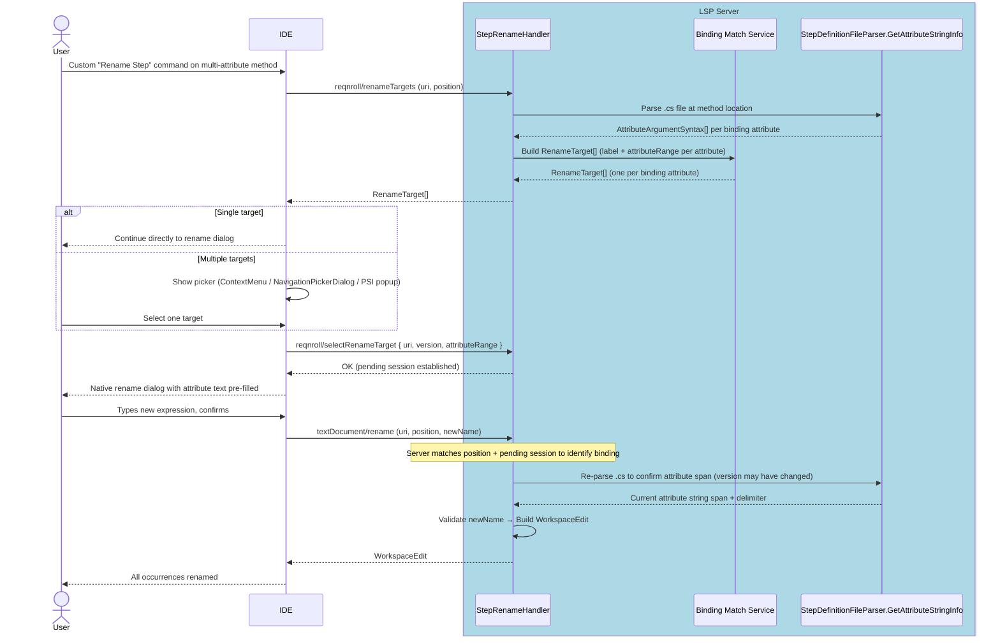

#### Error handling

| Scenario | Behaviour |
|----------|-----------|
| C# file is read-only or checked out to another user | The WorkspaceEdit fails for that file. `textDocument/rename` returns a `ResponseError` indicating the file that could not be modified. No partial rename is applied. |
| Feature file membership is in **pending** state (no `reqnroll/projectFiles` baseline) | The rename proceeds for all files that *can* be resolved. After the rename completes, the server publishes a `window/showMessage`: "Step renamed in N file(s). Note: project '{project}' has not reported its file membership — steps in that project may not have been updated." |
| Feature file in a linked project that has not yet sent membership | Same as pending state — logged, reported via `window/showMessage`. User is advised to trigger a project reload. |
| Binding registry becomes `Invalid` between `prepareRename` and `rename` | `ResponseError("The binding registry has been invalidated. Please try again after the project finishes loading.")` |
| User edits the `.cs` file between `prepareRename` and `rename` | Since `StepDefinitionFileParser.GetAttributeStringInfo` reads from the document buffer at `rename` time (via `CSharpStepDefinitionFile`), it always targets the current editor state. The `prepareRename` response warned the user with the old range, but the actual edit applies to the new version — which is correct behaviour (the user edited the file, and the rename should edit what's on screen). |

#### Implementation notes

- **LSP handler placement.** `StepRenameHandler` lives alongside the other OmniSharp handlers in `src/LSP/Reqnroll.IdeSupport.LSP.Server/Handlers/`. The handler registers for `textDocument/prepareRename` and `textDocument/rename` via the OmniSharp `ILanguageServer` router (same pattern as `FeatureDefinitionHandler`).
- **Validator class.** The validation rules (Rules 1-8) are extracted to a shared `StepRenameValidator` in `LSP.Core/Rename/` to separate concerns from the OmniSharp handler layer and enable unit testing.
- **Reuse existing expression parsing.** The Cucumber-expression parsing and parameter-slot extraction used by the existing VS `RenameStepCommand` lives in `Reqnroll.IdeSupport.Common/StepDefinitionExpressionParser`. The LSP server references the same library; `StepRenameValidator` delegates to it rather than reimplementing.
- **WorkspaceEdit construction.** The `WorkspaceEdit` builder (`Changes` / `DocumentChanges` dictionary) is populated from two sources: (a) `StepDefinitionFileParser.GetAttributeStringInfo` result for the C# attribute string edit (span + replacement text with correct escaping), and (b) each matching `.feature` step location from the binding-match result (step `SourceLocation` → `TextEdit` replacing the step text).
- **Phase 4 migration path for VS.** The existing `RenameStepCommand` (VSSDK) is retained and acts as a façade: for single-binding positions it delegates to the LSP `textDocument/rename` flow (via the same `LspInterceptingPipe` used by F14's custom command). For multi-attribute positions it shows the existing picker + `RenameStepViewModel` dialog. This dual-path approach lets the LSP rename ship in Phase 4 without regressing the rich VS validation UX, and the VS-specific code can be retired in a later release once the LSP dialog ecosystem catches up.
- **Linked files.** When the membership index (Q17) reports that a binding `.cs` file belongs to multiple projects, the rename handler unions the feature files from **all** including projects into the WorkspaceEdit. The handler calls `ILspWorkspaceScopeManager.GetProjectsForUri(bindingCsFile)` to get the owning set, then iterates each project's registry to find matching feature steps. This is the same multi-project routing already designed for F14/F15; the rename handler uses the same `GetProjectsForUri` API.

#### VS Code — as-built

F16's **single-binding** case is implemented on `master` as a thin pass-through to VS Code's native rename gesture: `reqnroll.renameStep` (bound to F2 for `gherkin`-language documents, `package.json` `contributes.keybindings`) calls `vscode.commands.executeCommand('editor.action.rename')`, which drives the standard `textDocument/prepareRename` / `textDocument/rename` flow already implemented server-side. No VS Code-specific validation or edit-application code exists — `vscode-languageclient` applies the returned `WorkspaceEdit` (spanning the `.cs` attribute and every matching `.feature` step) through its normal rename UI.

**Multi-attribute disambiguation is not yet on `master`.** As designed above, when the cursor resolves to more than one candidate binding, the server returns `null` from `prepareRename`, which makes VS Code report the standard "You cannot rename this element" message with no path to disambiguate — there is currently no VS Code-side consumer of the server's `reqnroll/renameTargets` / `reqnroll/selectRenameTarget` custom requests. This matches the "⚠️ Config" (not "🔧 Plugin") rating in the IDE support matrix above: today, VS Code relies entirely on the user manually clicking into the specific attribute string before invoking rename.

An open PR ([#27](https://github.com/clrudolphi/Reqnroll.IdeSupport/pull/27), branch `feat/vscode-rename-disambiguation`, unmerged as of this writing) adds a client-side `RenameMiddleware.prepareRename` override (`src/VSCode/src/renameDisambiguation.ts`) that queries `reqnroll/renameTargets` first: 0–1 candidates pass straight through to native `prepareRename` (no behavior change from what's on `master` today); 2+ candidates show a `vscode.window.showQuickPick` and send `reqnroll/selectRenameTarget` with the chosen index before letting the native rename input box open. The PR requires no server-side changes, since `reqnroll/renameTargets` and `reqnroll/selectRenameTarget` already exist for the Visual Studio disambiguation dialog. Until it merges, this parity gap with Visual Studio's picker-based disambiguation remains open.

---

### F17 · Hook Navigation

**Phase 3**

#### End-user experience

**Go to Hooks** shows the list of hook bindings that are in scope at the current cursor position in a `.feature` file, filtered by the tags and `[Scope]` expressions that apply there:

- From the `Feature:` line: shows `[BeforeTestRun]` / `[AfterTestRun]` and `[BeforeFeature]` / `[AfterFeature]` hooks
- From a `Scenario:` or `Scenario Outline:` line: additionally shows `[BeforeScenario]` / `[AfterScenario]` hooks
- From a step line: additionally shows `[BeforeStep]` / `[AfterStep]` and `[BeforeStepBlock]` / `[AfterStepBlock]` hooks

All results are filtered by the tags in scope at the cursor position matched against the `tags:` and `Scope[]` expressions of each candidate hook binding. Selecting an entry navigates to the C# hook method.

#### IDE support matrix

| VS Code | Visual Studio | Rider |
|---------|---------------|-------|
| 🔧 Plugin | 🔧 Plugin | 🔧 Plugin |

"Go to Hooks" does not map onto any standard IDE command (unlike Go to Definition, which has a universal F12 keybinding). Each IDE client requires custom plugin code to expose the feature.

Using `textDocument/definition` for this feature is not viable: F5 already uses that message to navigate to the step binding on step lines, so the server would have no way to distinguish "find step definition" from "find hooks" when the cursor is on a step line. Step-level hooks (`[BeforeStep]`/`[AfterStep]`) would be unreachable. Instead, the plugin sends a dedicated custom request `reqnroll/goToHooks`, which the server handles independently of the standard definition pipeline.

**Rider note**: Unlike F5 (which routes through `ReqnrollFeatureDefinitionReferenceProvider`), hook navigation uses the separate `reqnroll/goToHooks` message and requires its own PSI bridge handler. See [Architecture §6.3](LSP-IDE-Support-Architecture.md#63-rider).

#### Visual Studio — surface and UX details

The command is placed in the built-in `IDG_VS_CODEWIN_NAVIGATETOLOCATION` group of the code-editor context menu (the same group that hosts "Go To Definition" and "Find All References"). A `VisibleWhen` constraint restricts visibility to editors with the `reqnroll-gherkin` content type, so the item does not appear in C# or other file editors.

**Single result** — navigates directly to the hook method (no dialog).

**Multiple results** — shows a VS-themed modal dialog (`NavigationPickerDialog`, a `DialogWindow` subclass) with a vertical `ListBox` listing all candidates. Each entry is formatted as `[HookType] MethodName (filename:line)`. Selecting an entry and clicking **Go** (or double-clicking) navigates to that hook; closing or pressing Escape cancels.

The picker logic is encapsulated in a shared `NavigationPickerHelper` (static helper in the VS extension). The same helper is designed for reuse when F5 "Go to Step Definition" encounters multiple ambiguous bindings and needs to present a choice.

#### LSP messages

| Direction | Method | Purpose |
|-----------|--------|---------|
| Client → Server | `reqnroll/goToHooks` (uri, position) | Request hook locations for context |
| Server → Client | `GoToHooksResponse` (`hooks[]`) | C# hook method locations + metadata |

#### Sequence diagram

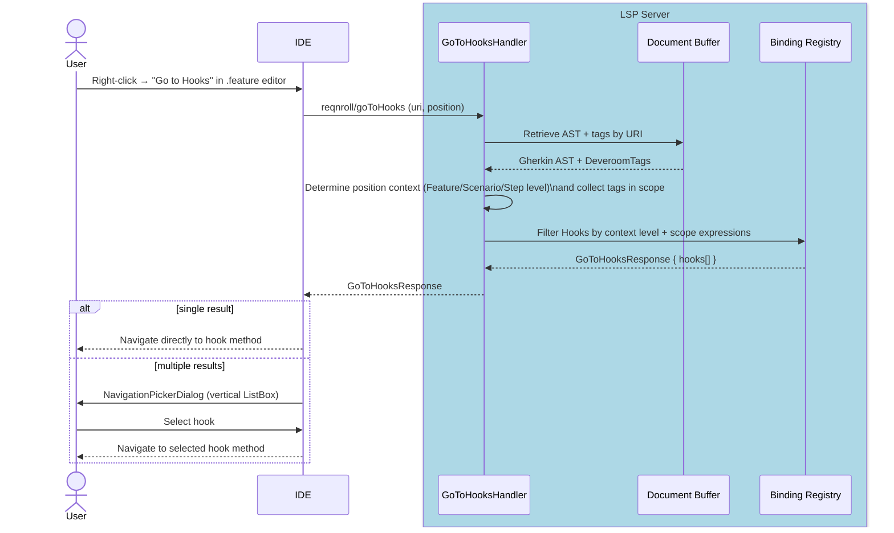

#### VS Code — as-built

F17 is **implemented** on `feat/vscode-extension-initial`:

| Design element | As-built |
|---|---|
| Command | `reqnroll.goToHooks`, available via editor context menu (`editor/context`, group `navigation@90`, `when: editorLangId == gherkin`) and the command palette; no default keybinding. |
| Request | `doGoToHooks` ([`hookNavigation.ts`](../src/VSCode/src/hookNavigation.ts)) reads the active editor's cursor position and sends the custom `reqnroll/goToHooks` request with `{textDocument, position}`. |
| Single vs. multiple results | A single hook navigates directly via `openAndReveal`. Multiple hooks show a `vscode.window.showQuickPick` with one entry per hook (`$(symbol-event) HookType`, method name as description, `Order: N` as detail when `hookOrder !== 0`) — the VS Code-idiomatic equivalent of the VS `NavigationPickerDialog` modal described above. |
| Navigation | `navigateToHook` opens the target `.cs` file and reveals the hook method's location via the shared `openAndReveal` helper (also used by F14 and F15). |

---

### F18 · Code Lens (Step Usage Counts)

**Phase 4**

#### End-user experience

C# step binding methods display an inline annotation above the method's binding attribute showing how many `.feature` steps currently match (e.g., "3 usages"). Clicking the annotation opens the references panel showing those step locations.

#### IDE support matrix

| VS Code | Visual Studio | Rider |
|---------|---------------|-------|
| ✅ Generic | 🔧 Plugin (VSSDK) | ⚠️ Config |

**Visual Studio note**: VS.Extensibility shipped `ICodeLensProvider` in VS 17.x (as a preview API). The VS plugin implements this interface directly rather than bridging via the legacy VSSDK `IVsCodeLensDataPointProvider`. `StepCodeLensProvider` is an `ExtensionPart` + `ICodeLensProvider` that is called once per C# _code element_ (method) in the active document. It fetches the full `textDocument/codeLens` response for the file from `StepCodeLensService` and then maps the attribute-level server lenses to the correct method.

**VS attribute-to-method mapping**: The LSP server (`StepCodeLensHandler`) emits one `CodeLens` item per step-binding _attribute_, with the item's range at the method-declaration line (0-based). VS.Extensibility, however, fires one `GetLabelAsync` callback per _method_, reporting the code-element range as starting at the method's _first attribute line_ (which may be one or more lines above the declaration when non-binding attributes such as `[Scope]` appear first). Additionally, VS processes visible methods bottom-to-top, calling `TryCreateCodeLensAsync`+`GetLabelAsync` as an interleaved pair per method before moving to the next.

To bridge the mismatch, `StepCodeLensState` maintains a per-file registry of method start lines. As each `TryCreateCodeLensAsync` fires it registers the reported line. By the time `GetLabelAsync` runs for method N, all methods below it (higher line numbers, processed earlier) are already registered. `GetNextMethodLine` returns the smallest registered line above the current method, providing a reliable upper bound. The filter `RangeLine >= currentStartLine && RangeLine < nextMethodStartLine` then selects exactly the server lenses that belong to this method. For the bottommost visible method (no next entry registered yet) a fixed `AttributeLookahead = 5` constant serves as fallback.

**Rider note**: Code Lens via LSP is supported but requires verification of how project-wide refresh is triggered when the Binding Registry changes.

#### LSP messages

| Direction | Method | Purpose |
|-----------|--------|---------|
| Client → Server | `textDocument/codeLens` | Request code lens items for `.cs` document |
| Client → Server | `codeLens/resolve` | Resolve lens command detail lazily |
| Server → Client | `CodeLens[]` response | Count annotations with command link |

#### Sequence diagram

```mermaid
sequenceDiagram
    participant IDE
    participant SCP as StepCodeLensProvider\n(VS only — ICodeLensProvider)

    box LightBlue LSP Server
        participant SCLH as StepCodeLensHandler
        participant BM as Binding Match Service
    end

    alt VS Code or Rider
        IDE->>SCLH: textDocument/codeLens (.cs file)
        SCLH->>BM: For each binding in file, get usage count from match cache
        BM-->>SCLH: UsageCount per binding
        SCLH-->>IDE: CodeLens[] (one per attribute; range = method-decl line)
        IDE-->>IDE: Render lens above each binding attribute
    else Visual Studio
        Note over IDE,SCP: VS.Extensibility ICodeLensProvider — one callback per C# method
        IDE->>SCP: TryCreateCodeLensAsync (code element = method,\nrange.Start = first-attribute line)
        SCP->>SCP: Register method start line in per-file bag
        IDE->>SCP: GetLabelAsync (same method)
        SCP->>SCLH: textDocument/codeLens (.cs file)
        SCLH->>BM: For each binding in file, get usage count from match cache
        BM-->>SCLH: UsageCount per binding
        SCLH-->>SCP: CodeLens[] (one per attribute; range = method-decl line)
        SCP->>SCP: Filter: RangeLine ∈ [currentStartLine, nextMethodStartLine)\nsum usage counts across all attributes on this method
        SCP-->>IDE: CodeLensLabel ("N step usage(s)")
        IDE-->>IDE: Render lens above first attribute of method
    end
```

#### VS Code — as-built

F18 is **implemented** on `feat/vscode-extension-initial`, matching the "✅ Generic" rating: VS Code's `CodeLensProvider` API maps directly onto `textDocument/codeLens` without the method-vs-attribute reconciliation VS.Extensibility's `ICodeLensProvider` requires (see the VS attribute-to-method mapping note above) — VS Code's provider is called once per document, not once per code element, so no per-method line-bucketing logic is needed:

| Design element | As-built |
|---|---|
| Registration | `registerStepCodeLens` ([`stepCodeLens.ts`](../src/VSCode/src/stepCodeLens.ts)) calls `vscode.languages.registerCodeLensProvider({ language: 'csharp' }, provider)` directly via the VS Code API — registered after `client.start()` resolves, in `extension.ts` — rather than through `vscode-languageclient`'s built-in CodeLens feature, specifically to avoid clashing with the C# extension's own CodeLens registration on `.cs` files. |
| Request | `provideCodeLenses` sends the raw `textDocument/codeLens` request (`CodeLensRequest.type`) for the document and maps each returned lens 1:1 to a `vscode.CodeLens`, preserving the server's range (method-declaration line) and command (title/command/arguments). A request failure logs a console warning and returns an empty array rather than surfacing an error to the user. |
| Refresh on registry change | Because the provider bypasses `vscode-languageclient`'s CodeLens feature, it also loses that feature's built-in listener for the server's `workspace/codeLens/refresh` push. `stepCodeLens.ts` compensates with its own `vscode.EventEmitter<void>` wired to `onDidChangeCodeLenses`, firing on `client.onRequest(CodeLensRefreshRequest.type, ...)` so lenses still refresh promptly after a binding registry change instead of only on incidental events like editor focus change. |
| `codeLens/resolve` | Not used — the server's `textDocument/codeLens` response already includes the fully resolved `command`, so no separate resolve round-trip is implemented client-side. |

---

### F19 · New Project / Item Wizards

**Phase 2** (Visual Studio only; other IDEs: snippets / live templates)

#### End-user experience

"New Project" offers a Reqnroll project template with test framework selection (NUnit, xUnit, MSTest). "Add New Item" offers a blank `.feature` file template and a step definitions class template.

#### IDE support matrix

| VS Code | Visual Studio | Rider |
|---------|---------------|-------|
| ❌ N/A (snippets instead) | 🔧 Plugin (VSSDK) | ❌ N/A (live templates instead) |

VS Code ships a snippet for scaffolding a feature file. Rider uses Live Templates. Only Visual Studio requires a VSSDK Wizard implementation.

#### LSP messages

None — wizards are entirely IDE-side. No LSP involvement.

#### Notes

- Uses `IVsProjectWizard` / `IWizard` VSSDK interfaces
- Wizard UI is WPF; shared with the existing Reqnroll.VisualStudio extension where possible
- VS.Extensibility does not expose a wizard API; VSSDK is the only option here

---

### F20 · Installation & Upgrade Experience

**Phase 3**

#### End-user experience

When the extension is installed for the first time, the user is greeted with a **welcome experience** (e.g., a getting-started page linking to documentation, the marketplace listing, and a quick tour of features). When the extension is **upgraded** to a new version, the user is shown a **"What's New"** experience summarizing notable changes since their previous version. These experiences make the Preview extension's value discoverable and signal active maintenance — important during the transition period while the existing `Reqnroll.VisualStudio` extension is still available.

For Visual Studio, the existing extension's installation and upgrade UX (welcome / what's-new pages and any first-run setup) is **ported** rather than rebuilt — the existing WPF UI and the version-detection logic that distinguishes a fresh install from an upgrade are reused.

#### IDE support matrix

| VS Code | Visual Studio | Rider |
|---------|---------------|-------|
| ⚠️ Config (walkthrough / release notes) | 🔧 Plugin (ported from existing extension) | ⚠️ Config (plugin "What's New") |

- **Visual Studio**: Port the existing extension's welcome / what's-new experience and first-run/upgrade detection. WPF UI shared with the existing `Reqnroll.VisualStudio` extension where possible.
- **VS Code**: Use the native [Walkthroughs](https://code.visualstudio.com/api/references/contribution-points#contributes.walkthroughs) contribution point for the getting-started experience and the marketplace's built-in release-notes (`CHANGELOG.md`) surface for upgrades — no custom UI required.
- **Rider**: Use the IntelliJ Platform plugin "What's New" / change-notes mechanism declared in `plugin.xml`.

#### LSP messages

None directly — installation and upgrade UX is entirely IDE-side. However, the **first-activation** and **version-change** moments are the natural producers of the `ExtensionInstalled` and `ExtensionUpgraded` telemetry events (see [Architecture §9 Telemetry](LSP-IDE-Support-Architecture.md#telemetry)). Because these events fire before or independently of the LSP server, the telemetry-architecture choice (Q11) and the client-reference question (Q8) directly affect how they are captured.

#### Notes

- Detecting install-vs-upgrade requires persisting the last-run version per IDE (e.g., extension storage / settings). The existing VS extension already implements this; reuse its approach.
- Each IDE client is responsible for its own install/upgrade UX; there is no shared cross-IDE implementation, though the telemetry event names are common.
- This feature is the primary in-product driver of the `ExtensionInstalled` / `ExtensionUpgraded` / `ExtensionDaysOfUsage` events listed in [Architecture §9 Telemetry](LSP-IDE-Support-Architecture.md#telemetry).

---

## Appendix B · Deferred / Future Features

The following features were identified during planning (see [discussion #1077](https://github.com/orgs/reqnroll/discussions/1077)) as valuable but out of scope for the initial phases. They are recorded here to inform architectural decisions — implementations should avoid foreclosing these options.

### Ambiguity Diagnostics

When a step in a `.feature` file matches more than one binding (ambiguous match), the step is flagged with a diagnostic and the code action menu offers navigation to each matching binding. This extends the Binding Match Service to return a `MatchResult` with multiple bindings rather than a single one.

### Regex Validation in Step Attributes

When editing a `[Given("...")]` attribute string in C#, the regex pattern is validated in real time. Malformed patterns are shown as error squiggles in the `.cs` file. Requires the LSP server to understand binding attribute context within C# files and the ability of the IDE client to combine built-in C# diagnostics with those provided by the Reqnroll LSP.

### Scope Expression Validation

`[Scope(Tag = "...")]` expressions are validated via the Tag Expression parser. Invalid tag expressions are highlighted with warning squiggle (via LSP Diagnostics; same caveats apply from above).

### Hook Matching Indicators

Visual indicators (e.g., a gutter icon or CodeLens annotation) in `.feature` files showing which scenarios or steps have hooks attached, providing a quick way to discover pre/post-conditions without navigating to C# code and provide a way to surface navigation links to those hooks.

### Debug Support for Feature Files

Breakpoints set on `.feature` file step lines would pause test execution at the corresponding step. Step-into would navigate to the bound C# method. This requires implementation of the Debug Adapter Protocol (DAP), a separate protocol from LSP, likely in coordination with the Reqnroll test runner.
